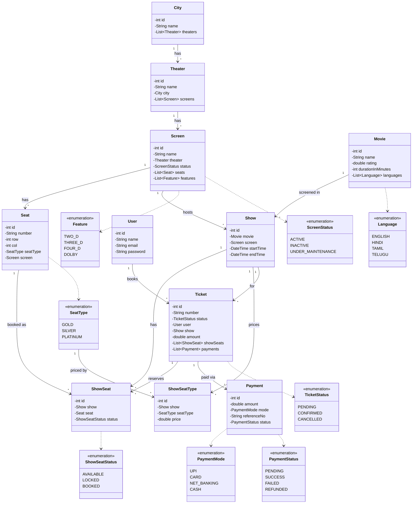

```mermaid
classDiagram
direction TB

    class City {
        -int id
        -String name
        -List~Theater~ theaters
    }

    class Theater {
        -int id
        -String name
        -City city
        -List~Screen~ screens
    }

    class Screen {
        -int id
        -String name
        -Theater theater
        -ScreenStatus status
        -List~Seat~ seats
        -List~Feature~ features
    }

    class Seat {
        -int id
        -String number
        -int row
        -int col
        -SeatType seatType
        -Screen screen
    }

    class Movie {
        -int id
        -String name
        -double rating
        -int durationInMinutes
        -List~Language~ languages
    }

    class Show {
        -int id
        -Movie movie
        -Screen screen
        -DateTime startTime
        -DateTime endTime
    }

    class ShowSeat {
        -int id
        -Show show
        -Seat seat
        -ShowSeatStatus status
    }

    class ShowSeatType {
        -int id
        -Show show
        -SeatType seatType
        -double price
    }

    class User {
        -int id
        -String name
        -String email
        -String password
    }

    class Ticket {
        -int id
        -String number
        -TicketStatus status
        -User user
        -Show show
        -double amount
        -List~ShowSeat~ showSeats
        -List~Payment~ payments
    }

    class Payment {
        -int id
        -double amount
        -PaymentMode mode
        -String referenceNo
        -PaymentStatus status
    }

    class SeatType {
        <<enumeration>>
        GOLD
        SILVER
        PLATINUM
    }

    class Feature {
        <<enumeration>>
        TWO_D
        THREE_D
        FOUR_D
        DOLBY
    }

    class Language {
        <<enumeration>>
        ENGLISH
        HINDI
        TAMIL
        TELUGU
    }

    class ScreenStatus {
        <<enumeration>>
        ACTIVE
        INACTIVE
        UNDER_MAINTENANCE
    }

    class ShowSeatStatus {
        <<enumeration>>
        AVAILABLE
        LOCKED
        BOOKED
    }

    class TicketStatus {
        <<enumeration>>
        PENDING
        CONFIRMED
        CANCELLED
    }

    class PaymentMode {
        <<enumeration>>
        UPI
        CARD
        NET_BANKING
        CASH
    }

    class PaymentStatus {
        <<enumeration>>
        PENDING
        SUCCESS
        FAILED
        REFUNDED
    }

    %% Location hierarchy
    City "1" --> "*" Theater : has
    Theater "1" --> "*" Screen : has
    Screen "1" --> "*" Seat : has

    %% Show setup
    Movie "1" --> "*" Show : screened in
    Screen "1" --> "*" Show : hosts
    Show "1" --> "*" ShowSeat : has
    Seat "1" --> "*" ShowSeat : booked as
    Show "1" --> "*" ShowSeatType : prices
    SeatType "1" --> "*" ShowSeatType : priced by

    %% Booking
    User "1" --> "*" Ticket : books
    Show "1" --> "*" Ticket : for
    Ticket "1" --> "*" ShowSeat : reserves
    Ticket "1" --> "*" Payment : paid via

    %% Enum usage
    Seat ..> SeatType
    Screen ..> Feature
    Screen ..> ScreenStatus
    Movie ..> Language
    ShowSeat ..> ShowSeatStatus
    Ticket ..> TicketStatus
    Payment ..> PaymentMode
    Payment ..> PaymentStatus
```