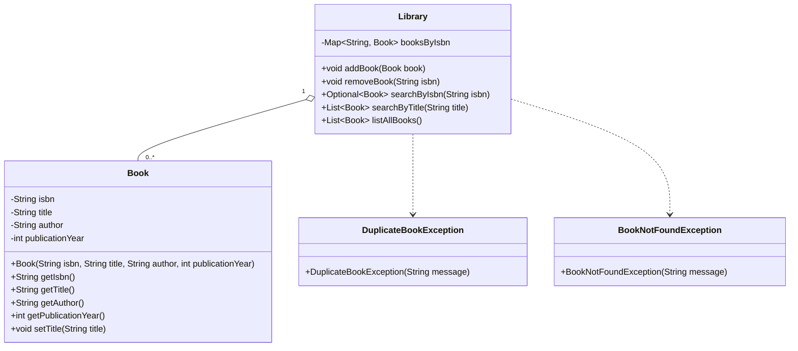

# Library Management System — Entity Design

## 1. Problem Statement

Design a simple Library Management System that manages a collection of logical books.

The goal of this exercise is not to build a production-ready library system — it's to practice **LLD entity design and machine-coding thinking**:

- Identify entities
- Identify responsibilities
- Define relationships
- Choose appropriate data structures
- Define APIs
- Handle business rules
- Implement the design cleanly
- Think about time complexity

---

## 2. Requirements

**Book** — every book has:
- ISBN
- Title
- Author
- Publication Year

**Library** — should support:
- Add a book
- Remove a book
- Search book by ISBN
- Search books by title
- List all books

---

## 3. Requirement Clarifications

### 3.1 ISBN

ISBN is the unique identifier of a logical book within the library: `ISBN → Book`.

- Two books cannot have the same ISBN.
- A duplicate ISBN add is **rejected** — the existing book is not overwritten.
- ISBN search is an **exact-match** search.

### 3.2 Removing a Book

Removing a book means removing the entire logical book record. Physical copies are out of scope.

```
removeBook("9780132350884")
```

removes the book identified by that ISBN. If the ISBN doesn't exist, the operation should report that the book was not found.

### 3.3 Searching by Title

Title search supports:
- Case-insensitive matching
- Partial/substring matching
- Multiple results

**Example** — given `Clean Code`, `Clean Architecture`, `Effective Java`, `Design Patterns`:

```
searchByTitle("clean") → Clean Code, Clean Architecture
```

There is no fuzzy matching or typo correction — `clen` does **not** need to match `Clean Code`.

An empty or null search term is invalid.

### 3.4 Listing Books

`listAllBooks()` returns all books. Ordering does not matter, so insertion order does not need to be maintained.

---

## 4. Out of Scope

To keep the entity design focused, the following are explicitly excluded:

- Physical book copies
- Library members
- Borrowing / returning
- Reservations
- Fines
- Notifications
- Database/persistence
- REST APIs
- UI
- Concurrency
- Authentication/authorization

---

## 5. Identifying Entities

From the requirements, we identify two entities: **Book** and **Library**.

**Book** — represents a book and its own state:

```
Book
├── ISBN
├── Title
├── Author
└── Publication Year
```

**Library** — manages a collection of books and applies collection-level rules:

```
Library
├── Books
└── Add / Remove / Search / List
```

---

## 6. Should Author Be a Separate Entity?

The requirement only needs an author *name* — there's no requirement for an author ID, biography, book list, search, multiple-author relationships, or author-specific operations.

**A plain `String author` is sufficient.** We should not introduce an `Author` class without a requirement that justifies it.

> **General LLD principle:** Don't create classes simply because something is a noun. Create a separate entity when the domain gives that concept its own identity, state, behavior, or relationships.

---

## 7. Publication Year — `String` or `int`?

We chose `int publicationYear` because a publication year is fundamentally numeric data (`2008`, `2017`, `2025`). Using `int` also makes numeric operations possible if requirements evolve.

---

## 8. Identifying Book Identity

**What uniquely identifies a `Book`?** → **ISBN.**

Therefore ISBN should be immutable:

```java
private final String isbn;   // no setIsbn()
```

Title, on the other hand, may change:

| Field | Mutability |
|---|---|
| ISBN | Immutable |
| Title | Mutable |

---

## 9. Responsibility of `Book`

`Book` manages its own state — ISBN, title, author, publication year — and can perform operations on itself, e.g. `book.setTitle("Clean Code - Updated")`.

`Book` should **not** know anything about the `Library`, the book collection, duplicate-ISBN checking, searching other books, or removing itself from the library.

---

## 10. Responsibility of `Library`

`Library` manages the collection of books: add, remove, search by ISBN, search by title, list — and enforces collection-level business rules. For example, **ISBN uniqueness** is a `Library`-level rule because it involves comparing a book against others in the collection.

---

## 11. Responsibility Separation

```
Book
├── Own ISBN
├── Own title
├── Own author
├── Own publication year
└── Change its own title

Library
├── Manage collection
├── Add book
├── Remove book
├── Search by ISBN
├── Search by title
├── List books
└── Enforce ISBN uniqueness
```

> **Principle:** `Book` manages its own state; `Library` manages collection-level rules.

---

## 12. Initial Data Structure Thought

A natural first thought:

```java
List<Book> books = new ArrayList<>();
```

This would work — but ask: **what is the most important lookup in our requirements?** ISBN, and it needs exact-match lookup. With an `ArrayList`, `searchByIsbn()` would compare against every book:

```
Complexity: O(N)
```

---

## 13. Choosing `HashMap`

Instead, use `Map<String, Book>` keyed by ISBN:

```java
private final Map<String, Book> booksByIsbn = new HashMap<>();
```

ISBN lookup becomes:

```java
booksByIsbn.get(isbn);   // O(1) average
```

The data structure naturally mirrors the domain relationship `ISBN → Book`.

---

## 14. Why Not a Title `HashMap`?

A second index, `Map<String, List<Book>> booksByTitle`, adds complexity: when `book.setTitle(...)` is called, the title index could go stale, requiring:

1. Remove the book from the old title entry
2. Update the title
3. Add the book to the new title entry

For current requirements, this complexity is unnecessary.

---

## 15. Title Search Strategy

Title search scans `booksByIsbn.values()`, converts each title to lowercase, and checks for the search term — `O(N)`, which is perfectly reasonable for this scope.

> **Design principle:** Don't optimize prematurely. Add complexity when the requirements justify it.

---

## 16. Handling Book Title Changes

```java
Book book = new Book("123", "Clean Code", "Robert Martin", 2008);
library.addBook(book);
// later:
book.setTitle("Clean Code - Updated");
```

Does `Library` need to do anything? **No** — title search reads the current title directly from each `Book`, so there's no separate index to update.

```
Book    → changes its own title
Library → manages the collection
```

---

## 17. Encapsulation

The internal map stays **private**:

```java
private final Map<String, Book> booksByIsbn;
```

❌ Don't expose it directly:

```java
public Map<String, Book> getBooks() {
    return booksByIsbn;   // lets callers bypass validation, e.g. books.put(isbn, book)
}
```

`Library` must control access to its internal collection.

---

## 18. Returning All Books

Internally: `Map<String, Book>`. The API needs `List<Book>`, so return a **copy**:

```java
new ArrayList<>(booksByIsbn.values());
```

This avoids exposing the internal collection.

---

## 19. Return Types

| Operation | Return type | On no match |
|---|---|---|
| Search by ISBN (unique) | `Optional<Book>` | `Optional.empty()` |
| Search by title (multiple) | `List<Book>` | empty list, never `null` |

---

## 20. Exceptions

| Exception | Used when |
|---|---|
| `DuplicateBookException` | ISBN already exists |
| `BookNotFoundException` | Requested ISBN does not exist |
| `IllegalArgumentException` | Invalid arguments — null book, null/empty title |

---

## 21–22. UML



---

## 23. Relationship Between `Library` and `Book`

```
1 Library
└── 0..* Books
```

This is **not** modeled as strong composition — a `Book` can conceptually exist independently of a particular `Library`:

```java
Book book = new Book(...);
Library library = new Library();
library.addBook(book);   // the Book already existed before being added
```

---

## 24. Final `Book` Implementation

```java
package library;

public class Book {

    private final String isbn;
    private String title;
    private final String author;
    private final int publicationYear;

    public Book(String isbn, String title, String author, int publicationYear) {
        this.isbn = isbn;
        this.title = title;
        this.author = author;
        this.publicationYear = publicationYear;
    }

    public String getIsbn() {
        return isbn;
    }

    public String getTitle() {
        return title;
    }

    public String getAuthor() {
        return author;
    }

    public int getPublicationYear() {
        return publicationYear;
    }

    public void setTitle(String title) {
        if (title == null || title.isBlank()) {
            throw new IllegalArgumentException("Title cannot be null or empty");
        }
        this.title = title;
    }
}
```

---

## 25–26. Custom Exceptions

```java
package library;

public class DuplicateBookException extends RuntimeException {
    public DuplicateBookException(String message) {
        super(message);
    }
}
```

```java
package library;

public class BookNotFoundException extends RuntimeException {
    public BookNotFoundException(String message) {
        super(message);
    }
}
```

---

## 27. Final `Library` Implementation

```java
package library;

import java.util.ArrayList;
import java.util.HashMap;
import java.util.List;
import java.util.Map;
import java.util.Optional;

public class Library {

    private final Map<String, Book> booksByIsbn = new HashMap<>();

    public void addBook(Book book) {
        if (book == null) {
            throw new IllegalArgumentException("Book cannot be null");
        }

        String isbn = book.getIsbn();

        if (booksByIsbn.containsKey(isbn)) {
            throw new DuplicateBookException(
                    "Book with ISBN " + isbn + " already exists"
            );
        }

        booksByIsbn.put(isbn, book);
    }

    public void removeBook(String isbn) {
        if (!booksByIsbn.containsKey(isbn)) {
            throw new BookNotFoundException(
                    "Book with ISBN " + isbn + " not found"
            );
        }

        booksByIsbn.remove(isbn);
    }

    public Optional<Book> searchByIsbn(String isbn) {
        return Optional.ofNullable(booksByIsbn.get(isbn));
    }

    public List<Book> searchByTitle(String title) {
        if (title == null || title.isBlank()) {
            throw new IllegalArgumentException("Search title cannot be null or empty");
        }

        String searchTerm = title.toLowerCase();
        List<Book> result = new ArrayList<>();

        for (Book book : booksByIsbn.values()) {
            if (book.getTitle().toLowerCase().contains(searchTerm)) {
                result.add(book);
            }
        }

        return result;
    }

    public List<Book> listAllBooks() {
        return new ArrayList<>(booksByIsbn.values());
    }
}
```

---

## 28. Testing the Implementation

```java
package library;

import java.util.List;

public class LibraryTest {

    public static void main(String[] args) {

        Library library = new Library();

        Book cleanCode = new Book(
                "9780132350884", "Clean Code", "Robert C. Martin", 2008
        );
        Book effectiveJava = new Book(
                "9780134685991", "Effective Java", "Joshua Bloch", 2018
        );
        Book cleanArchitecture = new Book(
                "9780134494166", "Clean Architecture", "Robert C. Martin", 2017
        );

        // Add books
        library.addBook(cleanCode);
        library.addBook(effectiveJava);
        library.addBook(cleanArchitecture);
        System.out.println("Books added successfully");

        // Search by ISBN
        library.searchByIsbn("9780132350884")
                .ifPresent(book -> System.out.println("ISBN Search: " + book.getTitle()));

        // Search by title
        List<Book> cleanBooks = library.searchByTitle("CLEAN");
        System.out.println("\nTitle Search:");
        for (Book book : cleanBooks) {
            System.out.println(book.getTitle());
        }

        // List all books
        System.out.println("\nAll Books:");
        for (Book book : library.listAllBooks()) {
            System.out.println(book.getTitle() + " - " + book.getAuthor());
        }

        // Change title
        cleanCode.setTitle("Clean Code - Updated");
        System.out.println("\nUpdated Title: " + cleanCode.getTitle());

        // Search after title update
        List<Book> updatedSearch = library.searchByTitle("updated");
        System.out.println("\nSearch After Title Update:");
        for (Book book : updatedSearch) {
            System.out.println(book.getTitle());
        }

        // Duplicate ISBN
        try {
            Book duplicateBook = new Book(
                    "9780132350884", "Another Book", "Some Author", 2025
            );
            library.addBook(duplicateBook);
        } catch (DuplicateBookException e) {
            System.out.println("\nDuplicate Test: " + e.getMessage());
        }

        // Remove book
        library.removeBook("9780134685991");
        System.out.println("\nBook removed successfully");

        // Verify removal
        System.out.println(
                "Search after removal: " + library.searchByIsbn("9780134685991").isPresent()
        );

        // Remove non-existing book
        try {
            library.removeBook("9999999999999");
        } catch (BookNotFoundException e) {
            System.out.println("Remove Missing Book Test: " + e.getMessage());
        }
    }
}
```

---

## 29. Method-by-Method Behavior

**`addBook(Book book)`**
```
Book → extract ISBN → already exists? ──Yes──▶ DuplicateBookException
                                       └──No──▶ add to map
```
Complexity: `O(1)` average.

**`removeBook(String isbn)`**
```
ISBN → exists? ──No──▶ BookNotFoundException
               └─Yes─▶ remove
```
Complexity: `O(1)` average.

**`searchByIsbn(String isbn)`**
```
ISBN → HashMap lookup → Optional<Book>
```
Complexity: `O(1)` average.

**`searchByTitle(String title)`**
```
Title → validate → lowercase → scan every Book → substring match → List<Book>
```
Complexity: `O(N)`.

**`listAllBooks()`**
```
Map values → new ArrayList → List<Book>
```
Complexity: `O(N)`.

---

## 30. Complexity Summary

| Operation | Data structure | Complexity |
|---|---|---|
| Add book | HashMap | O(1) average |
| Remove by ISBN | HashMap | O(1) average |
| Search by ISBN | HashMap | O(1) average |
| Search by title | Map values scan | O(N) |
| List all books | Map values copy | O(N) |

Space complexity: `O(N)`, where N is the number of books.

---

## 31. Why This Design Is Simple

We deliberately avoided: `BookCopy`, `Author`, `Member`, `BorrowRecord`, `Reservation`, `Fine`, `Notification`, `Database`, `Repository`, `Service`, `Controller`, `TitleIndex` — none are required by the current requirements.

```
Book
  ↑
  │
Library
  │
  └── Map<ISBN, Book>
```

This is enough to satisfy the requirements without over-engineering.

---

## 32. Important LLD Lessons

1. **Start with requirements** — don't immediately create `BookService`, `BookRepository`, `BookController`; understand what the system actually needs first.
2. **Identify identity** — ask "what makes two objects different?" Here, ISBN.
3. **Data structure follows requirements** — uniqueness + fast lookup → `Map<String, Book>`.
4. **Separate responsibilities** — `Book` owns its state; `Library` manages the collection. Don't put collection management inside `Book`.
5. **Avoid unnecessary indexes** — we could optimize title search, but that adds synchronization/update complexity the requirement doesn't need; `O(N)` is sufficient.
6. **Don't expose internal collections** — keep `booksByIsbn` private; return copies.
7. **Use appropriate return types** — `Optional<Book>` for a single result, `List<Book>` for multiple, never `null`.
8. **Entity owns its own state** — `book.setTitle(...)` belongs to `Book`; `Library` doesn't need to participate since there's no title index to maintain.

---

## 33. Final Design

```
┌─────────────────────┐
│       Library        │
├──────────────────────┤
│ Map<String, Book>    │
│    booksByIsbn       │
├──────────────────────┤
│ addBook()            │
│ removeBook()         │
│ searchByIsbn()       │
│ searchByTitle()      │
│ listAllBooks()       │
└──────────┬───────────┘
           │ manages
           ▼
┌──────────────────────┐
│         Book          │
├───────────────────────┤
│ ISBN                  │
│ Title                 │
│ Author                │
│ Publication Year      │
├───────────────────────┤
│ setTitle()            │
└───────────────────────┘
```

| Concept | Role |
|---|---|
| `Book` | Owns book state |
| `Library` | Owns collection management |
| ISBN | Unique identity |
| `HashMap` | Efficient ISBN operations |
| Title search | O(N) scan |
| Custom exceptions | Business-rule violations |
| Encapsulation | Internal collection stays private |

---

## 34. Final Takeaway

The most important thing from this exercise isn't the Java code — it's the thought process:

```
Requirements
    ↓
Identify entities
    ↓
Identify identity
    ↓
Assign responsibilities
    ↓
Choose data structures
    ↓
Define relationships
    ↓
Define APIs
    ↓
Define business rules
    ↓
Handle invalid cases
    ↓
Implement
    ↓
Analyze complexity
```

This is the same process that applies to other LLD entity-design problems.