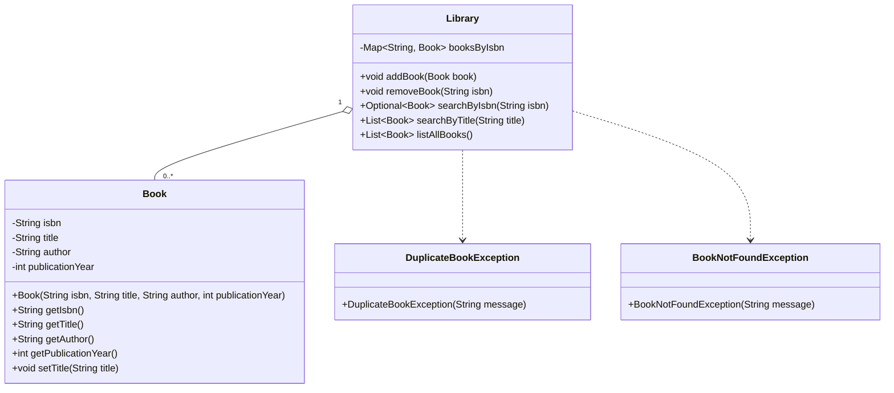

```text
classDiagram
    class Book {
        -String isbn
        -String title
        -String author
        -int publicationYear
        +Book(String isbn, String title, String author, int publicationYear)
        +String getIsbn()
        +String getTitle()
        +String getAuthor()
        +int getPublicationYear()
        +void setTitle(String title)
    }

    class Library {
        -Map~String, Book~ booksByIsbn
        +void addBook(Book book)
        +void removeBook(String isbn)
        +Optional~Book~ searchByIsbn(String isbn)
        +List~Book~ searchByTitle(String title)
        +List~Book~ listAllBooks()
    }

    class DuplicateBookException {
        +DuplicateBookException(String message)
    }

    class BookNotFoundException {
        +BookNotFoundException(String message)
    }

Library "1" o-- "0..*" Book
Library ..> DuplicateBookException
Library ..> BookNotFoundException
```


