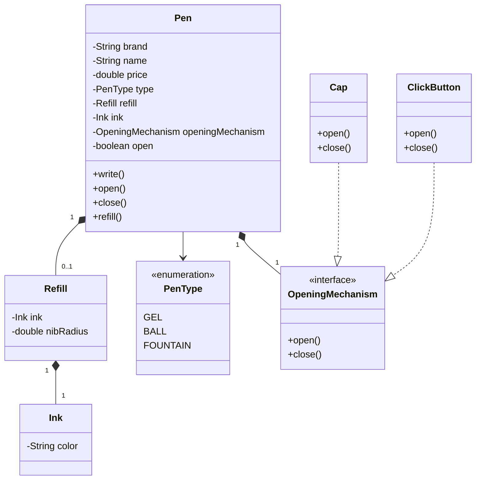

# Design a Pen — LLD Machine Coding

## 1. Problem Statement

Design a **Pen** using Object-Oriented Design principles.

The goal is to model the Pen entity and its behavior while demonstrating how to approach an LLD machine-coding problem in an interview.

> This is an **entity-level** LLD problem, not a complete Pen Management System.

**We focus on:**
- Object modeling
- Requirements clarification
- Class identification
- Relationships
- Abstraction
- Polymorphism
- Working implementation
- Validation of business rules

**We do *not* need:**
- REST APIs
- Database
- MVC
- Repository layer
- Service layer
- Persistent storage

---

## 2. Interview Approach

Standard LLD process:

```
Step 1 → Overview
Step 2 → Gather Requirements
Step 3 → Clarify Requirements
Step 4 → Class Diagram
Step 5 → Schema Diagram
Step 6 → Working Code
```

For an entity-level problem like Pen, this simplifies to:

```
Requirements → Class Diagram → Working Code
```

The schema diagram is skipped — there is no persistence requirement.

---

## 3. Step 1 — Overview

**Question:** What exactly are we designing?

**Answer:** We are designing a **Pen entity** using object-oriented principles.

We are **not** building:
- A pen store
- Pen inventory software
- An e-commerce system
- A pen management application

The focus is the physical Pen as an object.

---

## 4. Important Clarifications

| Question | Answer |
|---|---|
| What exactly am I building? | A Pen entity and its behavior |
| Do I need persistence? | No — no database storage |
| How does the user interact with the system? | N/A — entity-level design, not an interactive application |

---

## 5. Step 2 — Gather Requirements

| # | Requirement | Details |
|---|---|---|
| 1 | **Pen Definition** | Any physical entity that can write is considered a Pen |
| 2 | **Pen Types** | Gel Pen, Ball Pen, Fountain Pen |
| 3 | **Refill** | Gel & Ball pens have a refill; Fountain pens do not |
| 4 | **Ink** | A refill contains ink; different inks can have different colors |
| 5 | **Pen Properties** | Brand, Name, Price |
| 6 | **Opening Mechanism** | Cap or Click button |
| 7 | **Nib Radius** | Different refills can have different nib radii (e.g. 0.5mm, 0.7mm, 1.0mm) |
| 8 | **Pen Behavior** | Write, Open, Close, Refill |

**Requirement 3 visualized:**
```
Gel Pen  ──→ Refill
Ball Pen ──→ Refill
Fountain Pen ──→ No Refill
```

**Requirement 4 visualized:**
```
Refill → Ink → Color = Blue
```

---

## 6. Step 3 — Clarify Requirements

| # | Question | Decision |
|---|---|---|
| 1 | Can a closed Pen write? | **No** — a Pen must be open before it can write |
| 2 | Do we track exact ink quantity? | **No** — only ink and its color are needed now; quantity is future scope |
| 3 | How does a Fountain Pen get ink with no refill? | **Assumption:** Fountain Pen has an internal ink reservoir |
| 4 | Are refills compatible with every Pen? | Not specified — compatibility rules are not modeled yet |
| 5 | Can any Pen use either Cap or Click Button? | Yes — opening behavior is modeled as a separate abstraction |
| 6 | Does writing consume ink? | Not specified — ink consumption is not implemented |

**Question 3 resolution:**
```
Gel/Ball Pen → Refill → Ink
Fountain Pen → Internal Ink
```
> This is an important interview assumption and should be communicated to the interviewer.

---

## 7. Future Scope

Intentionally **not** implemented now:

- Ink quantity
- Ink consumption
- Refill compatibility
- Different nib types
- Writing thickness / pressure
- Fountain Pen cartridge / converter
- Ink reservoir capacity
- Multiple colors in one Pen
- Automatic refill detection

> **Principle:** Do not design for requirements that haven't been asked for.

---

## 8. Step 4 — Class Diagram

Three common ways to identify classes:

1. **Identifying Nouns** — extract nouns from requirements
2. **Visualization** — visualize the physical object and its components
3. **User Journey** — follow what the user does and identify objects involved

For this problem, we chose **Visualization**.

---

## 9. Visualization Approach

Imagining a physical Pen:

```
Pen
 ├── Refill
 │     └── Ink
 ├── Opening Mechanism
 │     ├── Cap
 │     └── Click Button
 └── Pen Type
```

> **Important:** A candidate concept does not automatically become a class. We must determine whether it has meaningful state, behavior, or abstraction.

---

## 10. Identify State and Behavior

### Pen

| State | Behavior |
|---|---|
| brand, name, price, type, refill, ink, openingMechanism, open | `write()`, `open()`, `close()`, `refill()` |

→ **Pen is a class.**

### Refill

**State:** `ink`, `nibRadius` — represents an independent physical component.

→ **Refill is a class.**

### Ink

**State:** `color`

→ **Ink is a class.**

### Opening Mechanism

Cap and ClickButton share the same conceptual behavior: `open()`, `close()`.

→ We introduce **OpeningMechanism** as an abstraction.

---

## 11. Interface vs. Abstract Class

```java
// Interface
interface OpeningMechanism {
    void open();
    void close();
}

// Abstract Class (rejected option)
abstract class OpeningMechanism {
    abstract void open();
    abstract void close();
}
```

The implementations don't share common state or implementation — only a contract.

→ **OpeningMechanism is an interface.**

```
          <<interface>>
        OpeningMechanism
             ▲
          ┌──┴───────┐
          │          │
         Cap    ClickButton
```

---

## 12. PenType

Fixed categories with no independent behavior → **enum**.

```java
enum PenType {
    GEL,
    BALL,
    FOUNTAIN
}
```

### Why not `GelPen`, `BallPen`, `FountainPen` classes?

Current requirements don't require significantly different behavior between types, so:

```
Pen
 └── PenType
       ├── GEL
       ├── BALL
       └── FOUNTAIN
```

is simpler than an inheritance hierarchy.

> **Principle:** Use inheritance when behavior genuinely differs, not merely because categories exist.

---

## 13. Relationships

| Relationship | Notation | Notes |
|---|---|---|
| Pen → Refill | `Pen 1 ─── 0..1 Refill` | Gel/Ball Pen has a Refill; Fountain Pen has none |
| Refill → Ink | `Refill ◆──── Ink` | A Refill contains Ink |
| Pen → OpeningMechanism | `Pen ◆──── OpeningMechanism` | A Pen has an opening mechanism |
| Cap/ClickButton → OpeningMechanism | `Cap ..\|> OpeningMechanism`<br>`ClickButton ..\|> OpeningMechanism` | Both implement the interface |
| Pen → PenType | `Pen ─── PenType` | A Pen has a type |

---

## 14. Complete UML Class Diagram



---

## 15. Step 5 — Schema Diagram

**Skipped.** This is an entity-level design with no database, tables, SQL, or persistence requirement.

```
Class Diagram → Working Code
```
is sufficient.

---

## 16. Step 6 — Working Code

We implement one requirement at a time.

### PenType

```java
package pen;

public enum PenType {
    GEL,
    BALL,
    FOUNTAIN
}
```

### Ink

```java
package pen;

public class Ink {
    private String color;

    public Ink(String color) {
        this.color = color;
    }

    public String getColor() {
        return color;
    }
}
```

### Refill

```java
package pen;

import pen.entity.Ink;

public class Refill {
    private Ink ink;
    private double nibRadius;

    public Refill(Ink ink, double nibRadius) {
        this.ink = ink;
        this.nibRadius = nibRadius;
    }

    public Ink getInk() {
        return ink;
    }

    public double getNibRadius() {
        return nibRadius;
    }
}
```

### OpeningMechanism

```java
package pen;

public interface OpeningMechanism {
    void open();
    void close();
}
```

### Cap

```java
package pen;

import pen.strategy.OpeningMechanism;

public class Cap implements OpeningMechanism {
    @Override
    public void open() {
        System.out.println("Cap removed");
    }

    @Override
    public void close() {
        System.out.println("Cap placed back");
    }
}
```

### ClickButton

```java
package pen;

import pen.strategy.OpeningMechanism;

public class ClickButton implements OpeningMechanism {
    @Override
    public void open() {
        System.out.println("Button clicked: pen opened");
    }

    @Override
    public void close() {
        System.out.println("Button clicked: pen closed");
    }
}
```

### Pen

```java
package pen;

import pen.entity.Ink;
import pen.entity.Refill;
import pen.enums.PenType;
import pen.strategy.OpeningMechanism;

public class Pen {
    private String brand;
    private String name;
    private double price;
    private PenType type;
    private Refill refill;
    private Ink ink;
    private OpeningMechanism openingMechanism;
    private boolean open;

    public Pen(
            String brand,
            String name,
            double price,
            PenType type,
            Refill refill,
            Ink ink,
            OpeningMechanism openingMechanism
    ) {
        if (type == PenType.FOUNTAIN && refill != null) {
            throw new IllegalArgumentException(
                    "Fountain pen cannot have a refill"
            );
        }
        if (type != PenType.FOUNTAIN && refill == null) {
            throw new IllegalArgumentException(
                    "Refill is required for this pen type"
            );
        }
        if (type == PenType.FOUNTAIN && ink == null) {
            throw new IllegalArgumentException(
                    "Fountain pen requires ink"
            );
        }
        this.brand = brand;
        this.name = name;
        this.price = price;
        this.type = type;
        this.refill = refill;
        this.ink = ink;
        this.openingMechanism = openingMechanism;
        this.open = false;
    }

    public void write() {
        if (!open) {
            throw new IllegalStateException("Pen is closed");
        }
        System.out.println(
                name + " is writing with " + getInkColor() + " ink"
        );
    }

    public void open() {
        if (open) {
            return;
        }
        openingMechanism.open();
        open = true;
    }

    public void close() {
        if (!open) {
            return;
        }
        openingMechanism.close();
        open = false;
    }

    public void refill(Refill refill) {
        if (type == PenType.FOUNTAIN) {
            throw new IllegalStateException(
                    "Fountain pen does not use a refill"
            );
        }
        if (refill == null) {
            throw new IllegalArgumentException(
                    "Refill cannot be null"
            );
        }
        this.refill = refill;
        System.out.println("Pen refilled successfully");
    }

    private String getInkColor() {
        if (type == PenType.FOUNTAIN) {
            return ink.getColor();
        }
        return refill.getInk().getColor();
    }
}
```

---

## 17. Application / Test

```java
package pen;

import pen.entity.Ink;
import pen.entity.Pen;
import pen.entity.Refill;
import pen.enums.PenType;
import pen.strategy.Cap;
import pen.strategy.ClickButton;

public class PenApplication {
    public static void main(String[] args) {
        // GEL PEN
        Ink blueInk = new Ink("Blue");
        Refill blueRefill = new Refill(blueInk, 0.5);
        Pen gelPen = new Pen(
                "Reynolds", "Trimax", 50,
                PenType.GEL, blueRefill, null, new Cap()
        );
        gelPen.open();
        gelPen.write();
        gelPen.close();
        System.out.println();

        // BALL PEN
        Ink blackInk = new Ink("Black");
        Refill blackRefill = new Refill(blackInk, 0.7);
        Pen ballPen = new Pen(
                "Parker", "Jotter", 100,
                PenType.BALL, blackRefill, null, new ClickButton()
        );
        ballPen.open();
        ballPen.write();
        ballPen.close();
        System.out.println();

        // FOUNTAIN PEN
        Ink fountainInk = new Ink("Blue");
        Pen fountainPen = new Pen(
                "Parker", "Vector", 1000,
                PenType.FOUNTAIN, null, fountainInk, new Cap()
        );
        fountainPen.open();
        fountainPen.write();
        fountainPen.close();
        System.out.println();

        // REFILL GEL PEN
        Ink redInk = new Ink("Red");
        Refill redRefill = new Refill(redInk, 0.5);
        gelPen.open();
        gelPen.refill(redRefill);
        gelPen.write();
        gelPen.close();
    }
}
```

---

## 18. Object Creation Flow

### Gel Pen

```
Ink → Refill → Pen
```

```java
Ink blueInk = new Ink("Blue");
Refill blueRefill = new Refill(blueInk, 0.5);
Pen gelPen = new Pen(
        "Reynolds", "Trimax", 50,
        PenType.GEL, blueRefill, null, new Cap()
);
```

**Resulting object graph:**
```
Pen
├── type → GEL
├── Refill
│   ├── nibRadius → 0.5
│   └── Ink
│       └── color → Blue
└── OpeningMechanism
    └── Cap
```

### Fountain Pen

A Fountain Pen has no refill — instead, per our assumption, it has internal ink.

```java
Pen fountainPen = new Pen(
        "Parker", "Vector", 1000,
        PenType.FOUNTAIN, null, new Ink("Blue"), new Cap()
);
```

**Object graph:**
```
Pen
├── type → FOUNTAIN
├── refill → null
├── ink → Blue
└── OpeningMechanism
    └── Cap
```

---

## 19. Polymorphism

The Pen doesn't depend directly on `Cap` or `ClickButton` — it depends on `OpeningMechanism`:

```java
OpeningMechanism mechanism = new Cap();
// or
OpeningMechanism mechanism = new ClickButton();
```

The Pen simply calls:
```java
openingMechanism.open();
openingMechanism.close();
```

This is **polymorphism**.

### Why this beats `if`/`else`

Avoided approach:
```java
if (mechanismType == CAP) {
    // cap logic
} else if (mechanismType == CLICK_BUTTON) {
    // click button logic
}
```

Instead, each implementation owns its own behavior:
```
OpeningMechanism
       ▲
 ┌─────┴──────┐
 Cap      ClickButton
```

---

## 20. Validation Rules

| # | Rule | Check |
|---|---|---|
| 1 | Fountain Pen cannot have a refill | `type == FOUNTAIN && refill != null` |
| 2 | Gel/Ball Pens require a refill | `type != FOUNTAIN && refill == null` |
| 3 | Fountain Pen requires ink | `type == FOUNTAIN && ink == null` |
| 4 | Closed Pen cannot write | `!open` → throw `IllegalStateException` |
| 5 | Fountain Pen cannot be refilled | `type == FOUNTAIN` → throw `IllegalStateException` |

---

## 21. Important Design Discovery

While implementing, we found a gap: if a Fountain Pen has no refill, **where does it get ink?**

This wasn't specified in the original requirements. We resolved it with an explicit assumption:

```
Fountain Pen → Internal Ink
```

> **LLD Principle:** Requirements clarification doesn't necessarily end before coding — implementation can expose missing or inconsistent requirements. The correct response is to identify the gap and clarify or state an assumption.

---

## 22. Complexity

| Operation | Complexity |
|---|---|
| `open()` | O(1) |
| `close()` | O(1) |
| `write()` | O(1) |
| `refill()` | O(1) |
| Get ink color | O(1) |

**Space complexity:** O(1) for a single Pen object and its associated objects.

---

## 23. OOP Concepts Demonstrated

| Concept | Example |
|---|---|
| **Encapsulation** | `private String brand;` — state is private, exposed only via methods |
| **Abstraction** | `interface OpeningMechanism` — defines *what*, hides *how* |
| **Polymorphism** | `OpeningMechanism mechanism` can refer to `Cap` or `ClickButton` |
| **Composition** | `Pen ◆── Refill`, `Refill ◆── Ink`, `Pen ◆── OpeningMechanism` |
| **Enum** | `PenType { GEL, BALL, FOUNTAIN }` — fixed categories |

---

## 24. Interview Discussion Points

**Q: Why is `OpeningMechanism` an interface?**
Because `Cap` and `ClickButton` share a contract but no common state or implementation.

**Q: Why isn't `PenType` an interface?**
Because Gel, Ball, and Fountain are fixed categories, not independently behaving objects.

**Q: Why not create `GelPen`, `BallPen`, `FountainPen`?**
Because current requirements don't require type-specific behavior.

**Q: Why is `Refill` a separate class?**
Because it has its own state (`ink`, `nibRadius`) and represents an independent physical component.

**Q: Why isn't `Ink` just a String?**
Because Ink is a domain concept that may gain additional behavior/state in future requirements.

**Q: Why isn't nib radius part of `Pen`?**
Because it belongs to the Refill — different refills can have different nib radii.

**Q: Why don't we have a database schema?**
Because this is an entity-level design and persistence isn't part of the requirements.

---

## 25. What We Deliberately Didn't Design

Avoided premature abstractions:

- PenBody, Nib, InkReservoir, Spring, ButtonMechanism
- Cartridge, Converter
- InkQuantity, WritingPressure, WritingThickness

> **Guiding principle:** Don't over-engineer the problem.

---

## 26. Final Design

```
                         ┌──────────────────────┐
                         │         Pen           │
                         ├──────────────────────┤
                         │ brand                 │
                         │ name                  │
                         │ price                 │
                         │ type                  │
                         │ refill                │
                         │ ink                   │
                         │ openingMechanism      │
                         │ open                  │
                         ├──────────────────────┤
                         │ write()               │
                         │ open()                │
                         │ close()               │
                         │ refill()              │
                         └──────────┬────────────┘
                                    │
                       ┌────────────┴────────────┐
                       │                          │
                       ▼                          ▼
                 ┌──────────┐          ┌────────────────────┐
                 │  Refill  │          │  OpeningMechanism   │
                 ├──────────┤          │    <<interface>>    │
                 │ ink      │          ├────────────────────┤
                 │ nib      │          │ open()               │
                 └────┬─────┘          │ close()              │
                      │                └──────────┬──────────┘
                      ▼                            │
                 ┌─────────┐              ┌────────┴────────┐
                 │   Ink   │              ▼                 ▼
                 ├─────────┤            Cap           ClickButton
                 │ color   │
                 └─────────┘

                 PenType <<enum>>
                 ├── GEL
                 ├── BALL
                 └── FOUNTAIN
```

---

## 27. Complete Interview Flow

```
LLD MACHINE CODING
        │
        ▼
Step 1: Overview → What exactly are we building?
        │
        ▼
Step 2: Requirements
        │
        ▼
Step 3: Clarification
        │
        ▼
Step 4: Class Diagram
        │
        ├── Visualization
        ├── Identify candidates
        ├── State + Behavior analysis
        ├── Relationships
        ├── Interface / Enum
        └── UML Diagram
        │
        ▼
Step 5: Schema → Not required
        │
        ▼
Step 6: Working Code
        │
        ├── Requirement by requirement
        ├── Test the design
        ├── Discover missing requirements
        └── Refine the design
```

---

## 28. Key Takeaways

1. Understand the problem before designing classes.
2. Clarify what exactly is being built.
3. For entity-level problems, don't unnecessarily introduce REST, MVC, or databases.
4. Use multiple techniques to identify classes: nouns, visualization, user journey.
5. A physical object does not automatically deserve a class.
6. Create a class when the concept has meaningful state, behavior, or abstraction.
7. Use interfaces when implementations share a contract without shared state/implementation.
8. Use enums for fixed categories with no independent behavior.
9. Don't create inheritance hierarchies just because different types exist.
10. Don't over-engineer future requirements.
11. Use composition when objects naturally form part of another object's structure.
12. Validate domain invariants early.
13. Implementation can expose missing requirements.
14. When a requirement is ambiguous, explicitly clarify it or state an assumption.
15. The goal of LLD is not to create the maximum number of classes.

> **The goal is a clean, extensible object model that correctly satisfies the given requirements without unnecessary complexity.**