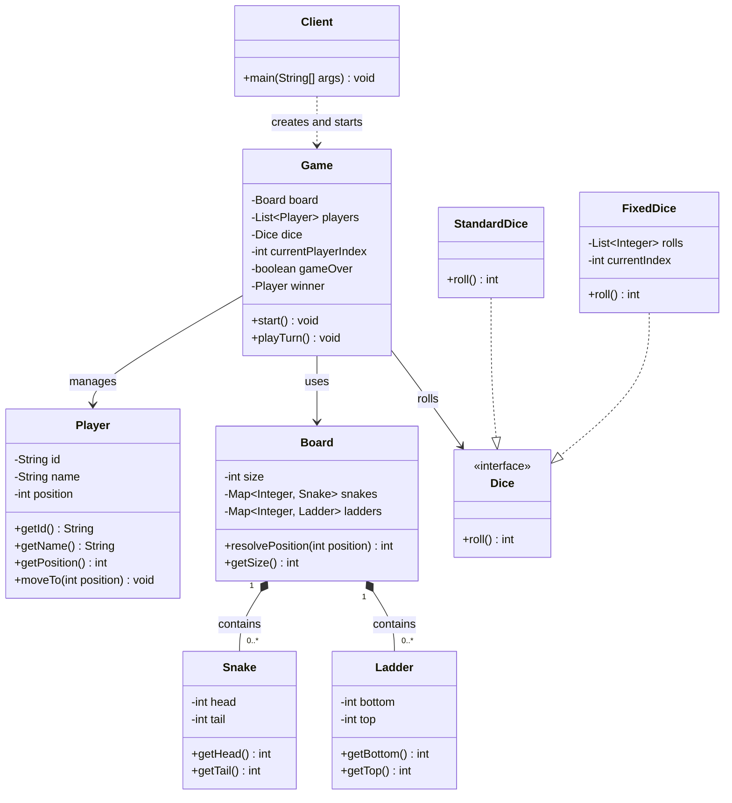

```mermaid
classDiagram
    class Client {
        +main(String[] args) void
    }

    class Game {
        -Board board
        -List~Player~ players
        -Dice dice
        -int currentPlayerIndex
        -boolean gameOver
        -Player winner
        +start() void
        +playTurn() void
    }
    class Player {
        -String id
        -String name
        -int position
        +getId() String
        +getName() String
        +getPosition() int
        +moveTo(int position) void
    }
    class Board {
        -int size
        -Map~Integer, Snake~ snakes
        -Map~Integer, Ladder~ ladders
        +resolvePosition(int position) int
        +getSize() int
    }
    class Snake {
        -int head
        -int tail
        +getHead() int
        +getTail() int
    }
    class Ladder {
        -int bottom
        -int top
        +getBottom() int
        +getTop() int
    }
    class Dice {
        <<interface>>
        +roll() int
    }
    class StandardDice {
        +roll() int
    }
    class FixedDice {
        -List~Integer~ rolls
        -int currentIndex
        +roll() int
    }
    Client ..> Game: creates and starts
    Game --> Board: uses
    Game --> Player: manages
    Game --> Dice: rolls
    Board "1" *-- "0..*" Snake: contains
    Board "1" *-- "0..*" Ladder: contains
    StandardDice ..|> Dice
    FixedDice ..|> Dice
```