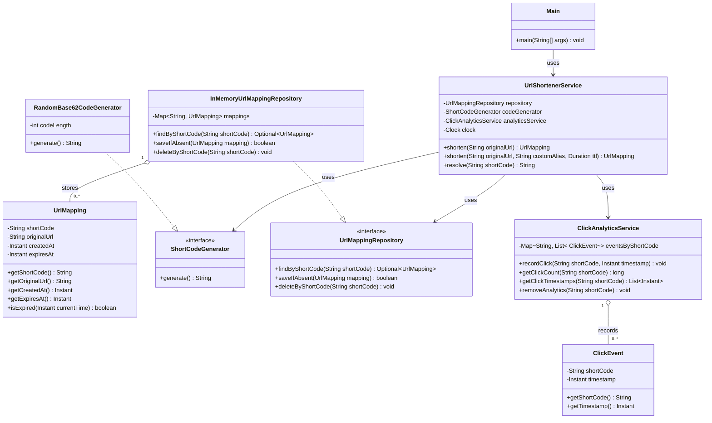

```mermaid
classDiagram
    direction TB

    class Main {
        +main(String[] args) void
    }

    class UrlShortenerService {
        -UrlMappingRepository repository
        -ShortCodeGenerator codeGenerator
        -ClickAnalyticsService analyticsService
        -Clock clock
        +shorten(String originalUrl) UrlMapping
        +shorten(String originalUrl, String customAlias, Duration ttl) UrlMapping
        +resolve(String shortCode) String
    }

    class UrlMapping {
        -String shortCode
        -String originalUrl
        -Instant createdAt
        -Instant expiresAt
        +getShortCode() String
        +getOriginalUrl() String
        +getCreatedAt() Instant
        +getExpiresAt() Instant
        +isExpired(Instant currentTime) boolean
    }

    class ShortCodeGenerator {
        <<interface>>
        +generate() String
    }

    class RandomBase62CodeGenerator {
        -int codeLength
        +generate() String
    }

    class UrlMappingRepository {
        <<interface>>
        +findByShortCode(String shortCode) Optional~UrlMapping~
        +saveIfAbsent(UrlMapping mapping) boolean
        +deleteByShortCode(String shortCode) void
    }

    class InMemoryUrlMappingRepository {
        -Map~String, UrlMapping~ mappings
        +findByShortCode(String shortCode) Optional~UrlMapping~
        +saveIfAbsent(UrlMapping mapping) boolean
        +deleteByShortCode(String shortCode) void
    }

    class ClickEvent {
        -String shortCode
        -Instant timestamp
        +getShortCode() String
        +getTimestamp() Instant
    }

    class ClickAnalyticsService {
        -Map~String, List~ ClickEvent~~ eventsByShortCode
        +recordClick(String shortCode, Instant timestamp) void
        +getClickCount(String shortCode) long
        +getClickTimestamps(String shortCode) List~Instant~
        +removeAnalytics(String shortCode) void
    }

    Main --> UrlShortenerService: uses
    UrlShortenerService --> UrlMappingRepository: uses
    UrlShortenerService --> ShortCodeGenerator: uses
    UrlShortenerService --> ClickAnalyticsService: uses
    RandomBase62CodeGenerator ..|> ShortCodeGenerator
    InMemoryUrlMappingRepository ..|> UrlMappingRepository

InMemoryUrlMappingRepository "1" o-- "0..*" UrlMapping: stores
ClickAnalyticsService "1" o-- "0..*" ClickEvent: records
```