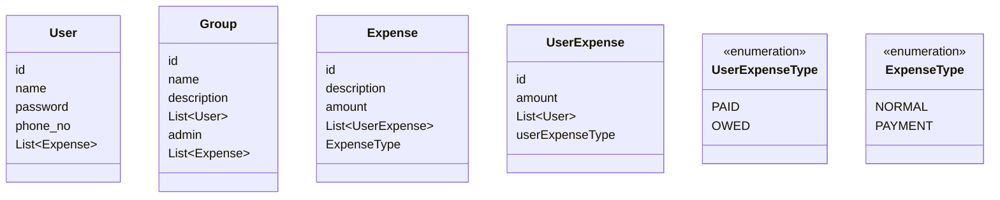
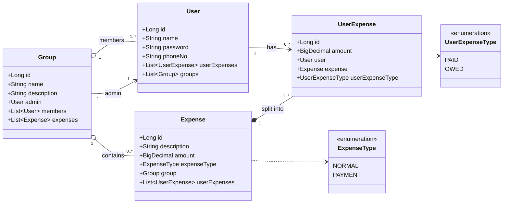

# Splitwise : Classes

```mermaid
classDiagram
    class User {
        id
        name
        password
        phone_no
        List~Expense~
    }
    
    class Group {
        id
        name
        description
        List~User~
        admin
        List~Expense~
    }
    
    class Expense {
        id
        description
        amount
        
        
        %% Map~User, Integer~ whoPaid
        %% Map~User, Integer~ whoOwns
        List~UserExpense~
        ExpenseType
    }
    
    class UserExpense {
        id
        amount
        List~User~
        userExpenseType
    }
    
    class UserExpenseType {
        <<enumeration>>
        
        PAID
        OWED
    }
    
    class ExpenseType {
        <<enumeration>>
        
        NORMAL
        PAYMENT
    }
    
```

# Splitwise : Class Diagram

```mermaid
classDiagram
    direction LR

    class User {
        +Long id
        +String name
        +String password
        +String phoneNo
        +List~UserExpense~ userExpenses
        +List~Group~ groups
    }

    class Group {
        +Long id
        +String name
        +String description
        +User admin
        +List~User~ members
        +List~Expense~ expenses
    }

    class Expense {
        +Long id
        +String description
        +BigDecimal amount
        +ExpenseType expenseType
        +Group group
        +List~UserExpense~ userExpenses
    }

    class UserExpense {
        +Long id
        +BigDecimal amount
        +User user
        +Expense expense
        +UserExpenseType userExpenseType
    }

    class UserExpenseType {
        <<enumeration>>
        PAID
        OWED
    }

    class ExpenseType {
        <<enumeration>>
        NORMAL
        PAYMENT
    }

    User "1" --> "0..*" UserExpense : has
    Expense "1" *-- "1..*" UserExpense : split into
    Group "1" o-- "1..*" User : members
    Group "1" --> "1" User : admin
    Group "1" o-- "0..*" Expense : contains
    UserExpense ..> UserExpenseType
    Expense ..> ExpenseType
```