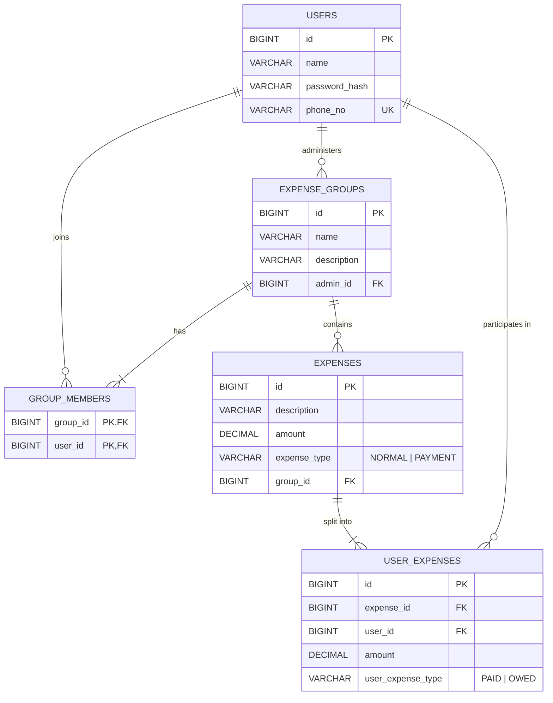

# Expense Sharing – Database Diagram

```mermaid
erDiagram
    USERS {
        BIGINT id PK
        VARCHAR name
        VARCHAR password_hash
        VARCHAR phone_no UK
    }

    EXPENSE_GROUPS {
        BIGINT id PK
        VARCHAR name
        VARCHAR description
        BIGINT admin_id FK
    }

    GROUP_MEMBERS {
        BIGINT group_id PK, FK
        BIGINT user_id PK, FK
    }

    EXPENSES {
        BIGINT id PK
        VARCHAR description
        DECIMAL amount
        VARCHAR expense_type "NORMAL | PAYMENT"
        BIGINT group_id FK
    }

    USER_EXPENSES {
        BIGINT id PK
        BIGINT expense_id FK
        BIGINT user_id FK
        DECIMAL amount
        VARCHAR user_expense_type "PAID | OWED"
    }

    USERS ||--o{ EXPENSE_GROUPS : "administers"
    USERS ||--o{ GROUP_MEMBERS : "joins"
    EXPENSE_GROUPS ||--|{ GROUP_MEMBERS : "has"
    EXPENSE_GROUPS ||--o{ EXPENSES : "contains"
    EXPENSES ||--|{ USER_EXPENSES : "split into"
    USERS ||--o{ USER_EXPENSES : "participates in"
```