# Tic Tac Toe — Final UML & Design

*Continues from the previous design documentation · Purpose: freeze the design before moving into Java implementation.*

```
REQUIREMENTS.md
      ↓
Entity Identification
      ↓
Responsibilities
      ↓
Design Decisions
      ↓
UML / Relationships
      ↓
Final Class Design
```

---

## 1. Final Design Decisions

| Area | Final Decision |
| --- | --- |
| Board | Configurable N × N |
| Minimum board size | 3 |
| Players | 2 to N − 1 |
| Player model | Abstract `Player` + `HumanPlayer` + `BotPlayer` |
| Bot behavior | `BotStrategy` |
| Bot strategies | Random, Easy, Medium, Unbeatable |
| Turn ordering | `TurnOrderStrategy` |
| Default turn order | Registration order |
| Alternative turn order | Random |
| Winning evaluation | `WinningStrategy` |
| Winning configuration | `Set<WinningStrategy>` |
| Winning strategies | Row, Column, Diagonal, Anti-Diagonal |
| Future winning strategy | Custom strategy |
| Board storage | `Player[][]` |
| Move | Player + Position |
| Position | Separate value object |
| Winning result | `List<WinningLine>` |
| Undo | `Stack<Move>` |
| Human/Bot undo | Revert complete previous human + bot cycle |
| Game states | NOT\_STARTED, IN\_PROGRESS, WON, DRAW |
| Persistence | In-memory |
| Interface | CLI |
| Number of games | One game per application execution |

---

## 2. Board Stores `Player[][]`

The board stores `Player[][]` instead of `char[][]`, because a board cell represents **ownership**, not merely a symbol.

```
X | O | X            Alice | Bob   | Alice
---------            ------+-------+------
  | X | O     →      null  | Alice | Bob
---------            ------+-------+------
  |   | X            null  | null  | Alice
```

The symbol can always be obtained from the player, so `Board → Player[][]` is the source of truth.

## 3. Why Not `char[][]`?

With `char[][] cells` the board knows only `X`, `O`, `X` — not who owns the cell. Other code would need extra logic to map `X → Player` and `O → Player`.

With `Player[][] cells`, `cells[row][column] → Player` directly. This helps with:

- winning evaluation
- identifying the winner
- displaying player information
- future UI requirements
- players with custom metadata

## 4. Board Responsibility

The `Board` only maintains board occupancy. Operations:

```
getSize()   isValidPosition()   isEmpty()
place()     remove()            getPlayer()
```

The board should **not** know whose turn it is, whether the game has started, whether someone has won, whether it is a draw, how a bot chooses a move, how turns are ordered, or when undo should happen.

> `Board` = state of the physical board · `Game` = game orchestration

---

## 5. Final Player Hierarchy

```
                Player
               /      \
              /        \
      HumanPlayer     BotPlayer
                          |
                     BotStrategy
```

`Player` is an abstract class holding common information: `id`, `name`, `symbol`, `image`.

## 6. Player

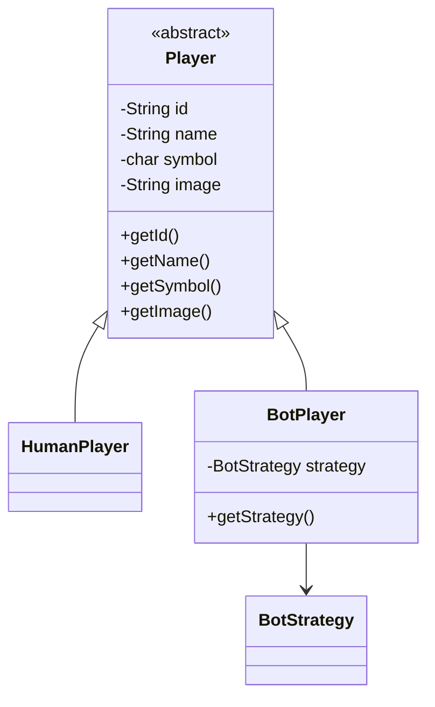

`Player` represents common identity and contains no bot-specific behavior.

## 7. HumanPlayer

`HumanPlayer` is a specialized `Player`. Actual CLI input should **not** be tightly coupled to this class.

```
CLI
 |
 +-- reads input
 +-- creates Position
 +-- Game processes move
```

rather than `HumanPlayer → Scanner → CLI logic`. This keeps the domain model independent of the presentation layer.

## 8. BotPlayer

`BotPlayer` extends `Player` and additionally has a `BotStrategy`.

```
BotPlayer
    |
    +-- identity
    +-- BotStrategy
```

The bot does not contain the algorithm for choosing a move; it delegates that decision to its strategy.

## 9. BotStrategy

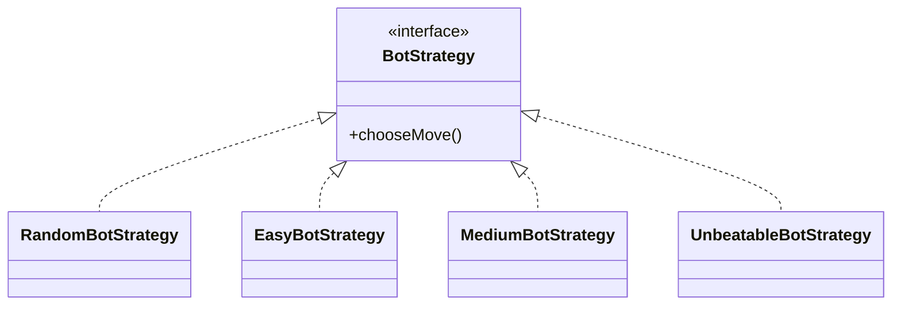

The key relationship is `BotPlayer has-a BotStrategy` — **composition / delegation**.

## 10. Why Bot Strategy Is Separate

Without the abstraction, `Game` could end up containing:

```java
if (botLevel == RANDOM) {
    ...
} else if (botLevel == EASY) {
    ...
} else if (botLevel == MEDIUM) {
    ...
} else if (botLevel == UNBEATABLE) {
    ...
}
```

This becomes increasingly difficult to maintain. Instead, `Game → BotPlayer → BotStrategy`: the game only asks *give me the bot's next move*, and the strategy decides how.

---

## 11. Position

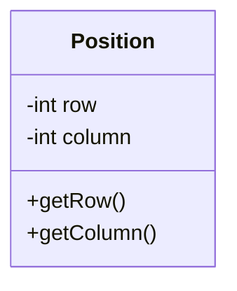

The domain uses **0-based** indexing; the CLI accepts **1-based** coordinates.

|  | Row | Column |
| --- | --- | --- |
| CLI | 1 | 2 |
| Internal | 0 | 1 |

The conversion belongs to the CLI/input boundary.

## 12. Move

A move represents one successful action.

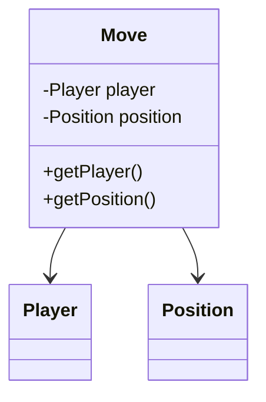

We deliberately **removed `symbol` from `Move`**, since the symbol already belongs to the player: `Move ├── Player └── Position`. The symbol is available via `Move → Player → Symbol`.

## 13. Why Move Does Not Store Symbol

If we had `Move.symbol = X` and `Move.player.symbol = O`, the information would be inconsistent — which one is correct? Removing the duplicate gives **one source of truth**: `Player.symbol`.

---

## 14. WinningStrategy

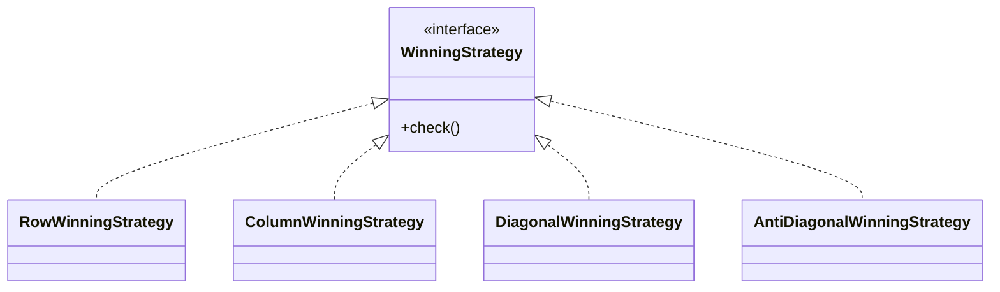

Each implementation focuses on one winning condition.

## 15. Winning Strategy Types

Initial strategies: `RowWinningStrategy`, `ColumnWinningStrategy`, `DiagonalWinningStrategy`, `AntiDiagonalWinningStrategy`. In future, a `CustomWinningStrategy` can be added without changing the core game orchestration.

## 16. Set of Winning Strategies

The `Game` uses `Set<WinningStrategy>` rather than a single strategy, e.g. Row + Column + Diagonal. The game evaluates all configured strategies; if one or more report a winning line, `GameState = WON`.

## 17. Why Set Instead of One Composite Strategy?

We considered a `CompositeWinningStrategy` containing Row, Column and Diagonal, but decided the game should directly own `Set<WinningStrategy>`, because the requirement describes winning conditions as configurable combinations:

```
Set 1: ROW + COLUMN
Set 2: ROW + COLUMN + DIAGONAL
Set 3: ROW + ANTI_DIAGONAL
```

This makes configuration explicit. The `Game` iterates over the configured strategies and collects all successful results.

## 18. WinningLine

A winning strategy should not return only `true`; we need to know which cells produced the win.

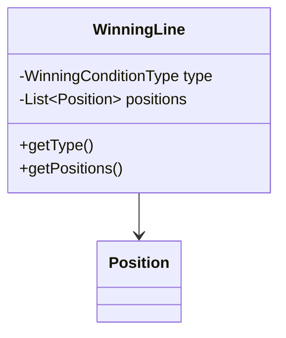

Example: type `ROW`, positions `(0,0) (0,1) (0,2)`.

## 19. WinningConditionType

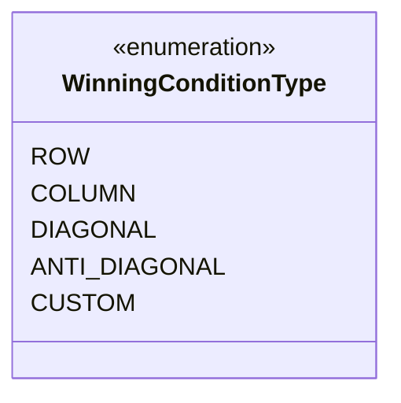

`CUSTOM` represents future extensibility; the actual custom strategy is not part of the current implementation scope.

## 20. Multiple Winning Lines

A move may satisfy multiple configured winning conditions, so the game maintains `List<WinningLine>` rather than a single `WinningLine`.

```
Winning Lines:
1. ROW     (0,0), (0,1), (0,2)
2. COLUMN  (0,0), (1,0), (2,0)
```

The final game result can therefore expose all winning lines.

---

## 21. TurnOrderStrategy

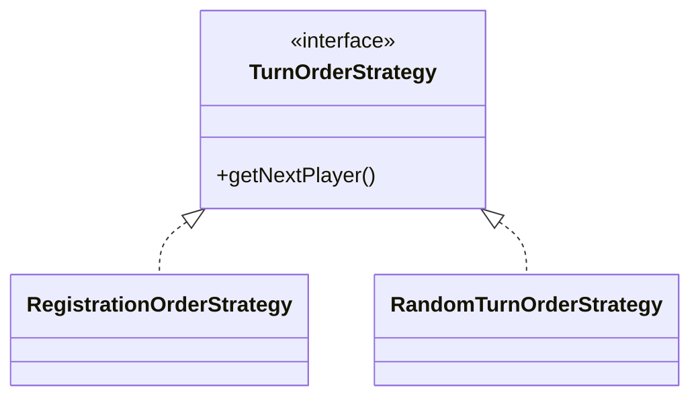

Default: `RegistrationOrderStrategy` (P1 → P2 → P3 → P1 → P2 → P3). Alternative: `RandomTurnOrderStrategy`.

## 22. Turn Order vs Bot Strategy

These must remain separate.

| Strategy | Answers |
| --- | --- |
| `TurnOrderStrategy` | Who plays next? |
| `BotStrategy` | What move should this bot make? |

```
TurnOrderStrategy
       |
       v
Current Player
       |
       +---- Human → external input
       +---- Bot   → BotStrategy
```

> This separation is one of the most important architectural decisions in the project.

## 23. GameState

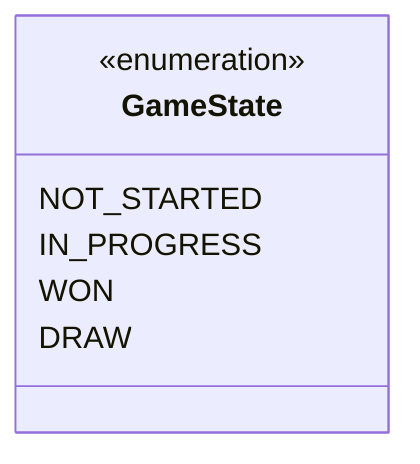

```
NOT_STARTED
     | start()
     v
IN_PROGRESS
    / \
   v   v
 WON   DRAW
```

Moves are allowed only while `IN_PROGRESS`. Undo is still allowed after `WON` or `DRAW`.

## 24. GameConfig

Game setup has multiple configurable values, so we introduce `GameConfig`:

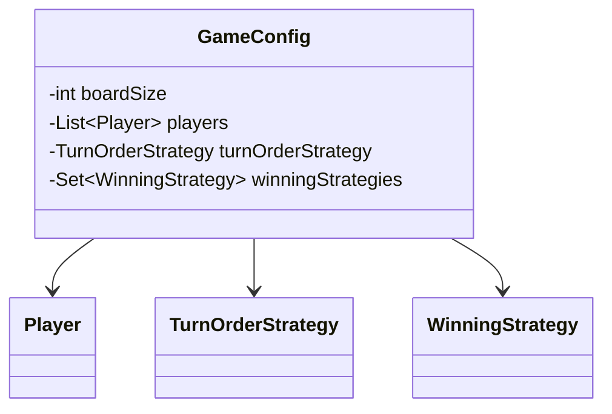

## 25. GameResult

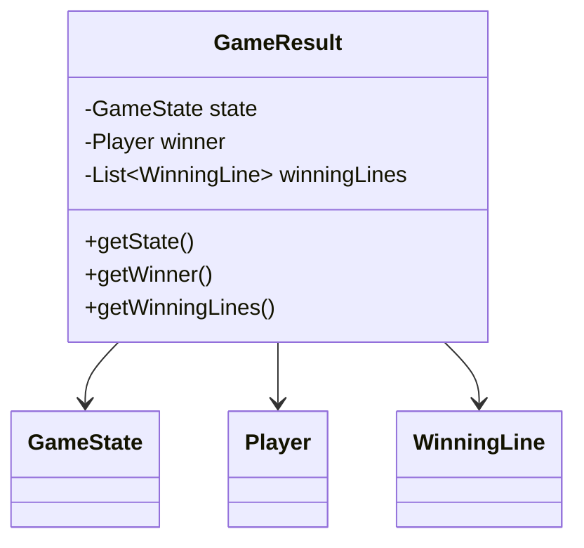

```
Win:   state = WON,  winner = Player, winningLines = [...]
Draw:  state = DRAW, winner = null,   winningLines = []
```

---

## 26. Undo Design

Undo uses `Stack<Move>`; every successful move is pushed. After Move 1–4, the stack top is Move 4. Undo pops Move 4, calls `Board.remove(position)`, and the game restores/recalculates the appropriate game state.

## 27. Why We Chose Move Stack

We considered snapshots (`Stack<GameSnapshot>`) but decided against them. For the current requirements the move stack is simpler, easier to explain, memory efficient, sufficient and natural for undo. Every successful move contains enough information to reverse the board change.

## 28. Human vs Bot Undo

Suppose Human, Bot, Human, Bot have played. The stack holds `Human 1, Bot 1, Human 2, Bot 2`. When the human chooses `UNDO`, we undo `Bot 2` **and** `Human 2`, not only `Bot 2`.

```
Resulting state:  Human 1, Bot 1
Current player:   Human
```

This behavior is implemented in the game orchestration layer.

---

## 29. Game

`Game` is the central coordinator.

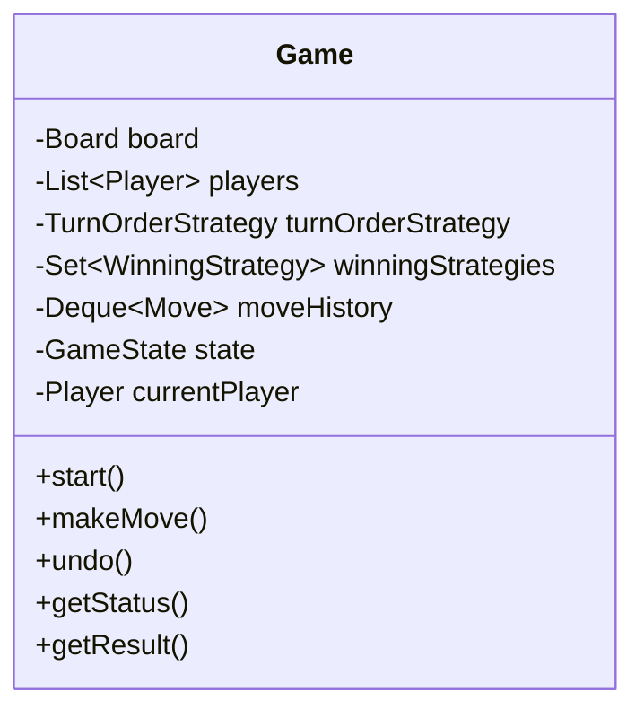

## 30. Game Responsibilities

| Concern | Handled by |
| --- | --- |
| Lifecycle | `start()` |
| Move processing | `makeMove()` |
| Turn management | `currentPlayer` |
| Win checking | `WinningStrategy` |
| Draw detection | Board full + no winner |
| Undo | Move history |
| Bot execution | `BotStrategy` |
| Game result | `GameResult` |

## 31. What Game Should NOT Do

`Game` should not contain: the random bot algorithm, minimax, row/column/diagonal detection, or random turn generation. Instead, `Game` **delegates to strategies**, which keeps the coordinator manageable.

---

## 32. Final Complete Class Diagram

The finalized conceptual UML for our implementation:

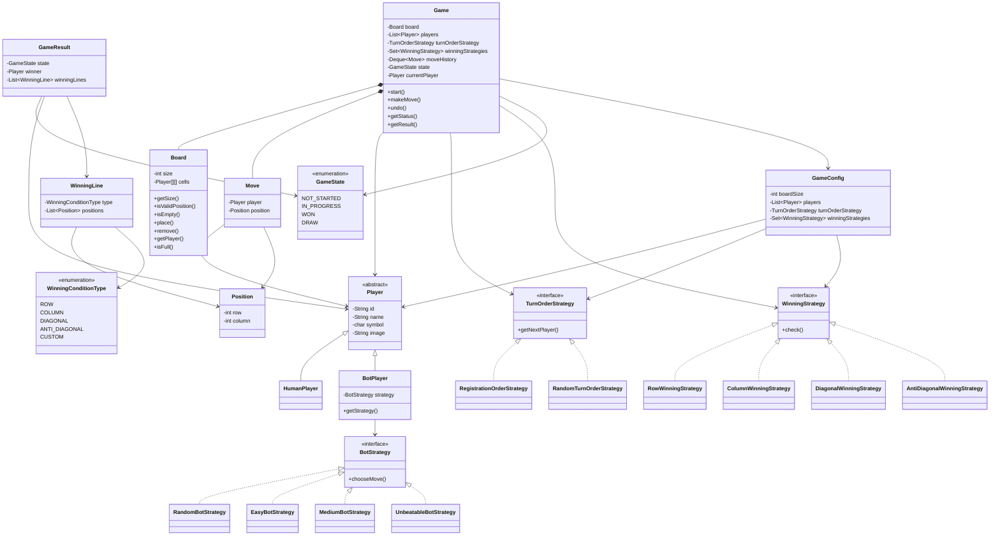

## 33. Understanding the UML Relationships

| Relationship | Example | Meaning |
| --- | --- | --- |
| Inheritance | \`Player < | -- HumanPlayer` ,  `Player < |
| Strategy implementation | \`WinningStrategy < | .. RowWinningStrategy\` |
| Composition | `Game *-- Board` | The board belongs to the game; the game also owns its move history |
| Association / dependency | `Game --> Player`, `Game --> WinningStrategy`, `Game --> TurnOrderStrategy`, `Move --> Player`, `Move --> Position` | Objects collaborate but are not in an inheritance relationship |

## 34. Final Responsibility Map

| Class / Interface | Responsibility |
| --- | --- |
| `Game` | Orchestrate game |
| `Board` | Maintain board occupancy |
| `Player` | Common player identity |
| `HumanPlayer` | Human player type |
| `BotPlayer` | Bot player + bot strategy |
| `BotStrategy` | Choose bot move |
| `Move` | Represent successful move |
| `Position` | Represent board coordinate |
| `WinningStrategy` | Evaluate one winning condition |
| `WinningLine` | Represent winning cells |
| `TurnOrderStrategy` | Decide next player |
| `GameConfig` | Hold game configuration |
| `GameResult` | Represent result |
| `GameState` | Represent lifecycle state |
| `WinningConditionType` | Identify winning line type |

---

## 35. Complete Game Flow

```
CLI
 |  setup
 v
GameConfig
 |
 v
Game
 |  start()
 v
IN_PROGRESS
 |
 v
TurnOrderStrategy
 |
 v
Current Player
 |
 +--------------------+
 |                    |
Human                Bot
 |                    |
 |                    v
CLI input         BotStrategy
 |                    |
 +---------+----------+
           |
           v
       Position
           |
           v
      Game validation
           |
           v
      Board.place()
           |
           v
      Move history
           |
           v
 WinningStrategy set
           |
      +----+----+
      |         |
    WIN       NO WIN
      |         |
      v         v
    WON      Board full?
                |
             +--+--+
             |     |
            Yes    No
             |     |
             v     v
           DRAW  Next turn
```

## 36. Move Validation Flow

Before modifying the board, `makeMove()` checks:

1. Game started?
2. Game already finished?
3. Correct player's turn?
4. Position valid?
5. Cell empty?

Only then: `Board.place()` → record `Move`.

> **Invalid moves must never modify the board or move history.**

## 37. Win Evaluation Flow

After every successful move, the move goes through the `WinningStrategy` set (Row, Column, Diagonal, Anti-Diagonal), which collects `WinningLine` objects. **Empty** → continue. **Non-empty** → `WON`.

## 38. Draw Evaluation Flow

```
Did someone win?
      |
   +--+--+
   |     |
  Yes    No
   |      |
  WON   Board full?
           |
        +--+--+
        |     |
       Yes    No
        |      |
       DRAW  Continue
```

A full board by itself is not a win. The order is always **WIN CHECK → DRAW CHECK**.

---

## 39. Strategy Pattern Usage

We use the Strategy Pattern in three independent places:

| Strategy | Controls |
| --- | --- |
| `BotStrategy` | How does a bot choose a move? |
| `TurnOrderStrategy` | Who plays next? |
| `WinningStrategy` | What constitutes a win? |

This is the central extensibility mechanism of our design.

## 40. Example Configuration

Board size 4, three players:

| Player | Symbol | Type |
| --- | --- | --- |
| Alice | X | Human |
| Bob | O | Bot (EASY) |
| John | # | Bot (RANDOM) |

Turn order: `RegistrationOrderStrategy`. Winning strategies: ROW, COLUMN, DIAGONAL.

```
GameConfig
 |
 +-- boardSize = 4
 +-- players
 |    +-- Alice
 |    +-- Bob
 |    +-- John
 +-- turnOrderStrategy
 |    +-- RegistrationOrderStrategy
 +-- winningStrategies
      +-- RowWinningStrategy
      +-- ColumnWinningStrategy
      +-- DiagonalWinningStrategy
```

## 41. Example of Extensibility — Winning

Six months later we want `SpiralWinningStrategy`. We implement `SpiralWinningStrategy implements WinningStrategy` and configure `Set<WinningStrategy>` as Row + Spiral. `Game` does not need to know how spiral winning works.

## 42. Example of Extensibility — Bots

We introduce `AggressiveBotStrategy implements BotStrategy`, then `BotPlayer → AggressiveBotStrategy`. Again, the core `Game` flow doesn't change.

---

## 43. Interview Talking Point — Strategy Pattern

**Q: Why did you use the Strategy Pattern here?**

> There are three independent behaviors that are expected to vary: bot move selection, turn ordering, and winning rules. Instead of hardcoding those algorithms inside `Game`, I extracted each variable behavior behind an interface. This allows new strategies to be introduced without modifying the core game orchestration.

## 44. Interview Talking Point — `Player[][]`

**Q: Why does Board store `Player[][]` instead of `char[][]`?**

> A board cell represents ownership by a player rather than merely a visual symbol. Using `Player[][]` allows the board to directly identify the player occupying a cell and avoids maintaining a separate symbol-to-player mapping. The symbol is presentation-related player metadata and remains owned by `Player`.

## 45. Interview Talking Point — `BotStrategy`

**Q: Why is BotStrategy not inside Game?**

> `Game` should coordinate the game, not implement every bot algorithm. Different bots can use different algorithms, so the decision-making behavior is delegated to `BotStrategy`. This keeps `Game` independent of the concrete bot algorithm.

## 46. Interview Talking Point — Winning Logic

**Q: Why isn't winning logic inside Board?**

> `Board` represents the physical state of the board. Winning is a game rule and can vary based on configuration. Therefore `Board` only exposes board state, while `WinningStrategy` evaluates whether a particular winning condition has been satisfied.

---

## 47. Design Phase Complete

```
Step 1 — Requirements
   ↓
Step 2 — Entity Identification
   ↓
Step 3 — Responsibilities
   ↓
Step 4 — Design Decisions
   ↓
Step 5 — UML / Relationships
   ↓
Step 6 — Final Class Design
```

The design is now ready for implementation.

## 48. Implementation Order

Implement in dependency order rather than randomly creating files:

1. **Enums** — `GameState`, `WinningConditionType`
2. **Value objects** — `Position`
3. **Player hierarchy** — `Player`, `HumanPlayer`, `BotPlayer`
4. **Move** — `Move`
5. **Board** — `Board`
6. **Winning model** — `WinningLine`, `WinningStrategy`, `RowWinningStrategy`, `ColumnWinningStrategy`, `DiagonalWinningStrategy`, `AntiDiagonalWinningStrategy`
7. **Bot strategies** — `BotStrategy`, `RandomBotStrategy`, `EasyBotStrategy`, `MediumBotStrategy`, `UnbeatableBotStrategy`
8. **Turn strategies** — `TurnOrderStrategy`, `RegistrationOrderStrategy`, `RandomTurnOrderStrategy`
9. **Configuration** — `GameConfig`
10. **Result** — `GameResult`
11. **Game** — `Game`
12. **CLI** — Application / CLI classes
13. **Tests**

This ordering builds from the smallest domain objects toward the game coordinator.

## 49. One Implementation Detail to Keep in Mind

The UML uses `Stack<Move>` conceptually. In Java we will likely use `Deque<Move>` with `ArrayDeque<Move>`, because `Deque` provides stack behavior without relying on the legacy `Stack` class. Conceptually it is still a stack of moves and fulfills the finalized design decision.

## 50. Final Architecture

```
                         +----------------+
                         |      Game      |
                         |  Coordinator   |
                         +-------+--------+
                                 |
             +-------------------+-------------------+
             |                   |                   |
             v                   v                   v
         +-------+           +--------+       +-------------+
         | Board |           |Players |       | Strategies  |
         +---+---+           +---+----+       +------+------+
             |                   |                    |
             |             +-----+-----+              |
             v             v           v              |
         Player[][]     Human       Bot               |
                                      |               |
                                      v               |
                                 BotStrategy          |
                                                      |
                              +-----------------------+------+
                              |                              |
                              v                              v
                       TurnOrderStrategy              WinningStrategy
                              |                              |
                       +------+-----+            +-----------+-----------+
                       |            |            |           |           |
                  Registration    Random        Row       Column     Diagonal
```

The system now has clear boundaries:

| Component | Role |
| --- | --- |
| Board | Stores state |
| Player | Represents participants |
| Move | Represents actions |
| Game | Coordinates |
| BotStrategy | Bot decision |
| TurnOrderStrategy | Turn decision |
| WinningStrategy | Winning decision |
| CLI | Presentation / input |

That gives us a solid foundation for the implementation phase.
