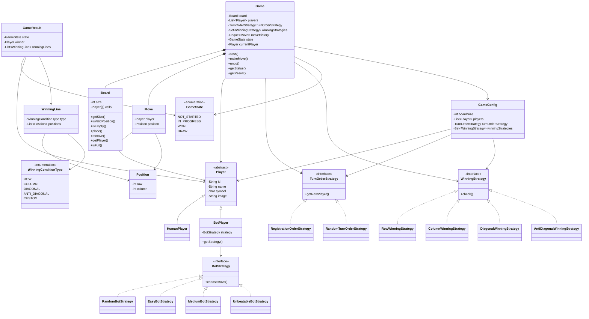

```mermaid
classDiagram
    class Game {
        -Board board
        -List~Player~ players
        -TurnOrderStrategy turnOrderStrategy
        -Set~WinningStrategy~ winningStrategies
        -Deque~Move~ moveHistory
        -GameState state
        -Player currentPlayer
        +start()
        +makeMove()
        +undo()
        +getStatus()
        +getResult()
    }
    class Board {
        -int size
        -Player[][] cells
        +getSize()
        +isValidPosition()
        +isEmpty()
        +place()
        +remove()
        +getPlayer()
        +isFull()
    }
    class Player {
        <<abstract>>
        -String id
        -String name
        -char symbol
        -String image
    }
    class HumanPlayer
    class BotPlayer {
        -BotStrategy strategy
        +getStrategy()
    }
    class Move {
        -Player player
        -Position position
    }
    class Position {
        -int row
        -int column
    }
    class WinningLine {
        -WinningConditionType type
        -List~Position~ positions
    }
    class GameConfig {
        -int boardSize
        -List~Player~ players
        -TurnOrderStrategy turnOrderStrategy
        -Set~WinningStrategy~ winningStrategies
    }
    class GameResult {
        -GameState state
        -Player winner
        -List~WinningLine~ winningLines
    }
    class GameState {
        <<enumeration>>
        NOT_STARTED
        IN_PROGRESS
        WON
        DRAW
    }
    class WinningConditionType {
        <<enumeration>>
        ROW
        COLUMN
        DIAGONAL
        ANTI_DIAGONAL
        CUSTOM
    }
    class BotStrategy {
        <<interface>>
        +chooseMove()
    }
    class TurnOrderStrategy {
        <<interface>>
        +getNextPlayer()
    }
    class WinningStrategy {
        <<interface>>
        +check()
    }
    Player <|-- HumanPlayer
    Player <|-- BotPlayer
    BotStrategy <|.. RandomBotStrategy
    BotStrategy <|.. EasyBotStrategy
    BotStrategy <|.. MediumBotStrategy
    BotStrategy <|.. UnbeatableBotStrategy
    TurnOrderStrategy <|.. RegistrationOrderStrategy
    TurnOrderStrategy <|.. RandomTurnOrderStrategy
    WinningStrategy <|.. RowWinningStrategy
    WinningStrategy <|.. ColumnWinningStrategy
    WinningStrategy <|.. DiagonalWinningStrategy
    WinningStrategy <|.. AntiDiagonalWinningStrategy
    BotPlayer --> BotStrategy
    Game *-- Board
    Game *-- Move
    Game --> Player
    Game --> TurnOrderStrategy
    Game --> WinningStrategy
    Game --> GameState
    Game --> GameConfig
    Move --> Player
    Move --> Position
    WinningLine --> Position
    WinningLine --> WinningConditionType
    GameResult --> GameState
    GameResult --> Player
    GameResult --> WinningLine
    GameConfig --> Player
    GameConfig --> TurnOrderStrategy
    GameConfig --> WinningStrategy
```