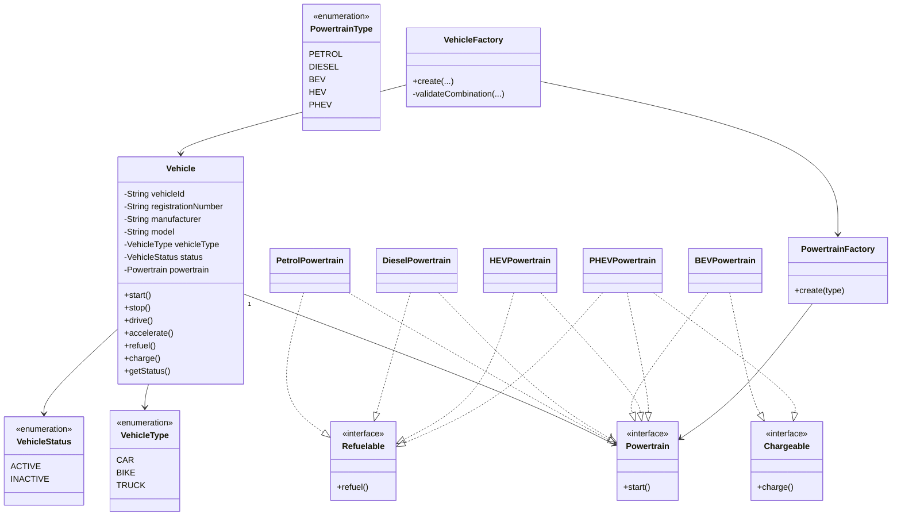

# Vehicle Entity Design

## 1. Problem Statement

Design a **Vehicle Entity** system that supports different types of vehicles and different powertrains.

**Vehicle Types**
- Car
- Bike
- Truck

**Vehicle Information** — every vehicle has:

| Field | Description |
|---|---|
| `vehicleId` | Unique identifier |
| `registrationNumber` | Registration number |
| `manufacturer` | Manufacturer name |
| `model` | Model name |
| `vehicleType` | CAR / BIKE / TRUCK |
| `status` | Current lifecycle status |
| `powertrain` | Powertrain implementation |

**Powertrains supported**
- Petrol
- Diesel
- BEV — Battery Electric Vehicle
- HEV — Hybrid Electric Vehicle
- PHEV — Plug-in Hybrid Electric Vehicle

**Vehicle Operations** (every vehicle)
- `start()`
- `stop()`
- `accelerate()`
- `drive()`

**Powertrain-specific Operations**

| Powertrain | Operations |
|---|---|
| Petrol | `start()`, `refuel()` |
| Diesel | `start()`, `refuel()` |
| BEV | `start()`, `charge()` |
| HEV | `start()`, `refuel()` *(not externally chargeable)* |
| PHEV | `start()`, `refuel()`, `charge()` |

**Valid Vehicle / Powertrain Combinations**

| Vehicle | Allowed Powertrains |
|---|---|
| Car | Petrol, BEV, HEV, PHEV |
| Bike | Petrol, BEV |
| Truck | Diesel |

Invalid combinations must be rejected.

---

## 2. Initial Design Questions

Before writing code, the key design question is:

> Should `Car`, `Bike`, and `Truck` be separate classes (inheritance), or a single `Vehicle` class with a `VehicleType` enum?

Inheritance looks natural at first, but ask: **do `Car`, `Bike`, and `Truck` currently have different behavior or data?**

Currently, no — all vehicles support `start`, `stop`, `drive`, and `accelerate` identically.

### Decision

Use a single `Vehicle` class with a `VehicleType` enum:

```
Vehicle
└── VehicleType
    ├── CAR
    ├── BIKE
    └── TRUCK
```

If vehicle-specific behavior appears later — e.g. `Car.openTrunk()`, `Bike.useKickstand()`, `Truck.loadCargo()` — subclasses can be introduced then.

---

## 3. Vehicle Type vs. Powertrain

These answer different questions:

| Concept | Question it answers | Examples |
|---|---|---|
| **VehicleType** | What kind of vehicle is this? | Car, Bike, Truck |
| **Powertrain** | What technology powers it? | Petrol, Diesel, BEV, HEV, PHEV |

They should be modeled **independently**:

```
Vehicle
├── VehicleType
│     ├── CAR
│     ├── BIKE
│     └── TRUCK
│
└── Powertrain
      ├── Petrol
      ├── Diesel
      ├── BEV
      ├── HEV
      └── PHEV
```

This allows any valid combination — `CAR + PETROL`, `CAR + BEV`, `CAR + HEV`, `CAR + PHEV`, `BIKE + PETROL`, `BIKE + BEV`, `TRUCK + DIESEL` — without duplicating vehicle logic.

**Relationship:** Vehicle **HAS-A** Powertrain (not *IS-A*).

---

## 4. Design Decision #1 — Composition Over Inheritance

Instead of:

```java
class Vehicle extends Powertrain
```

we use:

```java
class Vehicle {
    private Powertrain powertrain;
}
```

**Why:** Vehicle and Powertrain represent different responsibilities.

| Vehicle represents | Powertrain represents |
|---|---|
| Identity | How the vehicle starts |
| Vehicle information | Powertrain-specific capabilities |
| Vehicle lifecycle | |
| Driving behavior | |

---

## 5. Powertrain Abstraction

All powertrains need `start()`, so:

```java
interface Powertrain {
    void start();
}
```

`Vehicle` depends on the `Powertrain` abstraction, not concrete classes:

```java
private final Powertrain powertrain;
// ...
powertrain.start();
```

It doesn't care whether the implementation is `PetrolPowertrain`, `DieselPowertrain`, `BEVPowertrain`, `HEVPowertrain`, or `PHEVPowertrain` — this is polymorphism in action.

---

## 6. Why Not Put Everything Inside `Powertrain`?

A tempting but flawed design:

```java
interface Powertrain {
    void start();
    void refuel();
    void charge();
}
```

**Problem:** BEV cannot refuel, Petrol cannot charge — so implementations would be forced to implement operations they don't support (`BEVPowertrain.refuel()` ❌, `PetrolPowertrain.charge()` ❌). This is a leaky abstraction.

---

## 7. Capability Interfaces

Separate optional capabilities into their own interfaces:

```java
public interface Refuelable {
    void refuel();
}

public interface Chargeable {
    void charge();
}
```

Each powertrain implements only what it supports:

| Powertrain | Interfaces implemented |
|---|---|
| Petrol | `Powertrain`, `Refuelable` |
| Diesel | `Powertrain`, `Refuelable` |
| BEV | `Powertrain`, `Chargeable` |
| HEV | `Powertrain`, `Refuelable` |
| PHEV | `Powertrain`, `Refuelable`, `Chargeable` |

---

## 8. Powertrain Implementations

```java
public class PetrolPowertrain implements Powertrain, Refuelable {

    @Override
    public void start() {
        System.out.println("Petrol engine started");
    }

    @Override
    public void refuel() {
        System.out.println("Petrol vehicle refueled");
    }
}
```

```java
public class DieselPowertrain implements Powertrain, Refuelable {

    @Override
    public void start() {
        System.out.println("Diesel engine started");
    }

    @Override
    public void refuel() {
        System.out.println("Diesel vehicle refueled");
    }
}
```

```java
public class BEVPowertrain implements Powertrain, Chargeable {

    @Override
    public void start() {
        System.out.println("Electric motor started");
    }

    @Override
    public void charge() {
        System.out.println("Battery charging");
    }
}
```

```java
public class HEVPowertrain implements Powertrain, Refuelable {

    @Override
    public void start() {
        System.out.println("Hybrid powertrain started");
    }

    @Override
    public void refuel() {
        System.out.println("Hybrid vehicle refueled");
    }
}
```

```java
public class PHEVPowertrain implements Powertrain, Refuelable, Chargeable {

    @Override
    public void start() {
        System.out.println("Plug-in hybrid powertrain started");
    }

    @Override
    public void refuel() {
        System.out.println("Plug-in hybrid vehicle refueled");
    }

    @Override
    public void charge() {
        System.out.println("Plug-in hybrid battery charging");
    }
}
```

---

## 9. Enums

```java
public enum VehicleType {
    CAR,
    BIKE,
    TRUCK
}

public enum VehicleStatus {
    ACTIVE,
    INACTIVE
}

public enum PowertrainType {
    PETROL,
    DIESEL,
    BEV,
    HEV,
    PHEV
}
```

---

## 10. `PowertrainFactory`

A client could directly write `new PetrolPowertrain()`, `new BEVPowertrain()`, etc. — but that couples the client to concrete implementations.

`PowertrainFactory` answers: *given a `PowertrainType`, which `Powertrain` implementation should be created?*

```java
public class PowertrainFactory {

    private PowertrainFactory() {
    }

    public static Powertrain create(PowertrainType type) {

        if (type == null) {
            throw new IllegalArgumentException(
                    "Powertrain type cannot be null"
            );
        }

        return switch (type) {
            case PETROL -> new PetrolPowertrain();
            case DIESEL -> new DieselPowertrain();
            case BEV -> new BEVPowertrain();
            case HEV -> new HEVPowertrain();
            case PHEV -> new PHEVPowertrain();
        };
    }
}
```

---

## 11. Why Use a Factory?

Without it, the caller knows the concrete class:

```java
Powertrain powertrain = new PHEVPowertrain();
```

With it, the caller only knows the type:

```java
Powertrain powertrain = PowertrainFactory.create(PowertrainType.PHEV);
```

```
Client → PowertrainFactory → PHEVPowertrain
```

---

## 12. What Should `PowertrainFactory` Validate?

**Question:** Should it validate vehicle/powertrain compatibility, e.g. reject `PowertrainFactory.create(VehicleType.TRUCK, PowertrainType.BEV)`?

**No.** `PowertrainFactory` should only know `PowertrainType → Powertrain implementation`. It should not know vehicle-specific business rules — that's `VehicleFactory`'s job.

---

## 13. Vehicle Entity

A `Vehicle` contains: `vehicleId`, `registrationNumber`, `manufacturer`, `model`, `vehicleType`, `status`, `powertrain`.

```
Vehicle
└── has-a Powertrain
```

The `powertrain` field is `final` — a vehicle should not change its powertrain during its lifecycle.

---

## 14. Vehicle Lifecycle

A new vehicle starts as `INACTIVE`:

```
        start()
INACTIVE ──────► ACTIVE
   ▲                │
   └──── stop() ─────┘
```

**Rules:**
- `start()` only when `INACTIVE`
- `stop()` only when `ACTIVE`
- `drive()` only when `ACTIVE`
- `accelerate()` only when `ACTIVE`
- `refuel()` only when `INACTIVE`
- `charge()` only when `INACTIVE`

---

## 15. Why Status Isn't a Constructor Parameter

We should **not** allow:

```java
new Vehicle(..., VehicleStatus.ACTIVE);
```

because someone could create an `ACTIVE` vehicle without actually starting its powertrain. Instead:

```java
this.status = VehicleStatus.INACTIVE;
```

Only `start()` can transition the vehicle to `ACTIVE`, keeping the object's state consistent.

---

## 16. `Vehicle.start()`

```java
public void start() {
    ensureInactive();
    powertrain.start();
    status = VehicleStatus.ACTIVE;
}
```

**Ordering matters.**

❌ Incorrect:
```java
status = VehicleStatus.ACTIVE;
powertrain.start();   // if this fails, status is wrongly ACTIVE
```

✅ Correct: update `status` only *after* the powertrain successfully starts.

---

## 17. `Vehicle.stop()`

```java
public void stop() {
    ensureActive();
    status = VehicleStatus.INACTIVE;
}
```

The requirement doesn't specify powertrain-specific stopping behavior, so we don't add `Powertrain.stop()` just because `start()` exists — model only what's required.

---

## 18. Driving and Acceleration

Both require an `ACTIVE` vehicle:

```java
public void drive() {
    ensureActive();
    System.out.println("Vehicle is driving");
}

public void accelerate() {
    ensureActive();
    System.out.println("Vehicle is accelerating");
}
```

This prevents `INACTIVE + drive()` and `INACTIVE + accelerate()`.

---

## 19. Refueling

`Vehicle` delegates to the powertrain's capability:

```java
public void refuel() {
    ensureInactive();

    if (!(powertrain instanceof Refuelable refuelable)) {
        throw new UnsupportedOperationException(
                "Vehicle does not support refueling"
        );
    }

    refuelable.refuel();
}
```

Note: we check `instanceof Refuelable`, **not** `instanceof PetrolPowertrain` / `DieselPowertrain` / `HEVPowertrain`. The vehicle cares about capability, not concrete implementation.

---

## 20. Charging

```java
public void charge() {
    ensureInactive();

    if (!(powertrain instanceof Chargeable chargeable)) {
        throw new UnsupportedOperationException(
                "Vehicle does not support charging"
        );
    }

    chargeable.charge();
}
```

Again, we check the `Chargeable` capability, not the concrete class.

---

## 21. State Validation Helpers

```java
private void ensureActive() {
    if (status != VehicleStatus.ACTIVE) {
        throw new IllegalStateException(
                "Vehicle must be active for this operation"
        );
    }
}

private void ensureInactive() {
    if (status != VehicleStatus.INACTIVE) {
        throw new IllegalStateException(
                "Vehicle must be inactive for this operation"
        );
    }
}
```

This keeps public methods clean and avoids repeating state checks.

---

## 22. Exception Types

| Exception | Used when | Example |
|---|---|---|
| `IllegalArgumentException` | Supplied input itself is invalid | `TRUCK + BEV` |
| `IllegalStateException` | Object is in the wrong state | `INACTIVE + drive()`, `ACTIVE + start()` |
| `UnsupportedOperationException` | Vehicle lacks a requested capability | `BEV + refuel()` |

This separation makes API behavior clearer.

---

## 23. Input Validation

```java
private static String requireText(String value, String fieldName) {
    if (value == null || value.isBlank()) {
        throw new IllegalArgumentException(
                fieldName + " cannot be null or blank"
        );
    }
    return value;
}
```

For enum/object references, use `Objects.requireNonNull(...)` — this gives fail-fast validation.

---

## 24. `VehicleFactory`

Needs to enforce valid vehicle/powertrain combinations:

```
CAR   → PETROL, BEV, HEV, PHEV
BIKE  → PETROL, BEV
TRUCK → DIESEL
```

---

## 25. Representing Compatibility Rules

Rather than a large if/else or switch, represent the rule as a map:

```java
Map<VehicleType, Set<PowertrainType>>
```

Conceptually:

```
CAR   → {PETROL, BEV, HEV, PHEV}
BIKE  → {PETROL, BEV}
TRUCK → {DIESEL}
```

This directly represents the business rule.

---

## 26. `VehicleFactory` Implementation

```java
import java.util.Map;
import java.util.Objects;
import java.util.Set;

public class VehicleFactory {

    private static final Map<VehicleType, Set<PowertrainType>>
            ALLOWED_POWERTRAINS = Map.of(
                    VehicleType.CAR,
                    Set.of(
                            PowertrainType.PETROL,
                            PowertrainType.BEV,
                            PowertrainType.HEV,
                            PowertrainType.PHEV
                    ),

                    VehicleType.BIKE,
                    Set.of(
                            PowertrainType.PETROL,
                            PowertrainType.BEV
                    ),

                    VehicleType.TRUCK,
                    Set.of(
                            PowertrainType.DIESEL
                    )
            );

    private VehicleFactory() {
    }

    public static Vehicle create(
            String vehicleId,
            String registrationNumber,
            String manufacturer,
            String model,
            VehicleType vehicleType,
            PowertrainType powertrainType
    ) {
        Objects.requireNonNull(vehicleType, "vehicleType cannot be null");
        Objects.requireNonNull(powertrainType, "powertrainType cannot be null");

        validateCombination(vehicleType, powertrainType);

        Powertrain powertrain = PowertrainFactory.create(powertrainType);

        return new Vehicle(
                vehicleId,
                registrationNumber,
                manufacturer,
                model,
                vehicleType,
                powertrain
        );
    }

    private static void validateCombination(
            VehicleType vehicleType,
            PowertrainType powertrainType
    ) {
        Set<PowertrainType> allowedPowertrains =
                ALLOWED_POWERTRAINS.get(vehicleType);

        if (!allowedPowertrains.contains(powertrainType)) {
            throw new IllegalArgumentException(
                    "Invalid combination: "
                            + vehicleType
                            + " cannot use "
                            + powertrainType
            );
        }
    }
}
```

---

## 27. Why Does `VehicleFactory` Validate?

`Vehicle` itself only knows its `vehicleType` and that a `powertrain` exists — it doesn't own the business rule that *"trucks can only use diesel."* `VehicleFactory` is the creation boundary:

```
VehicleFactory
├── validate combination
├── PowertrainFactory
└── Vehicle
```

---

## 28. Why Two Factories?

| Factory | Responsibility |
|---|---|
| `PowertrainFactory` | Which implementation corresponds to a `PowertrainType`? (`PETROL → PetrolPowertrain`, etc.) |
| `VehicleFactory` | Is this vehicle/powertrain combination valid, and how do I create the `Vehicle`? (`CAR + PHEV` → valid, `BIKE + PHEV` → invalid, `TRUCK + BEV` → invalid) |

Different responsibilities justify separate factories.

---

## 29. API Trade-off: `refuel()` / `charge()` on `Vehicle`

A BEV has `charge()` but not `refuel()` — so `BEV.refuel()` throws `UnsupportedOperationException`, and `Petrol.charge()` throws the same.

---

## 30. Alternative: Fully Capability-Oriented API

An alternative avoids putting `refuel()`/`charge()` directly on `Vehicle`, instead exposing capabilities independently:

```
Vehicle
└── Powertrain
      ├── Refuelable
      └── Chargeable
```

This avoids unsupported operations appearing on the `Vehicle` API, but adds complexity. For this problem's scope, the simpler `Vehicle` API with internal capability checks is acceptable — revisit if the system grows.

---

## 31. Why Not Create `Car`, `Bike`, `Truck` Classes Yet?

They currently have no unique behavior or data, so subclassing would add complexity without solving a real problem. Keep `Vehicle` + `VehicleType` for now; introduce subclasses (`Car.openTrunk()`, `Bike.useKickstand()`, `Truck.loadCargo()`) only when required.

---

## 32. Design Review — SOLID

**Single Responsibility**

| Class | Responsibility |
|---|---|
| `Vehicle` | Vehicle state and behavior |
| `Powertrain` | Startup behavior |
| `Refuelable` | Refueling capability |
| `Chargeable` | Charging capability |
| `PowertrainFactory` | Powertrain creation |
| `VehicleFactory` | Vehicle creation + compatibility validation |

**Open/Closed** — `Vehicle` depends on the `Powertrain` abstraction; new powertrains can be added without changing `Vehicle`.

**Interface Segregation** — no single bloated `Powertrain` interface; `Refuelable`/`Chargeable` are separate, so implementations only get what they need.

**Dependency Inversion** — `Vehicle` depends on `Powertrain`, not `PetrolPowertrain`/`PHEVPowertrain`/`BEVPowertrain`.

---

## 33. Design Patterns Used

- **Factory Pattern** — `PowertrainFactory`, `VehicleFactory` centralize creation logic.
- **Strategy-style Composition** — powertrain implementations provide interchangeable startup behavior; `Vehicle` delegates to whichever `Powertrain` it holds.

---

## 34. What We Deliberately Did *Not* Add

`VehicleService`, `VehicleManager`, `VehicleRepository`, `VehicleValidator`, `VehicleBuilder`, `VehicleCapabilityManager`, a database layer, a persistence layer.

> **Key LLD principle:** Do not over-engineer the solution before the requirements justify it.

---

## 35. Testing Strategy — Valid / Invalid Creation

**Valid creation** (should succeed): `CAR+PETROL`, `CAR+BEV`, `CAR+HEV`, `CAR+PHEV`, `BIKE+PETROL`, `BIKE+BEV`, `TRUCK+DIESEL`

**Invalid creation** (should fail with `IllegalArgumentException`): `TRUCK+PETROL`, `TRUCK+BEV`, `TRUCK+HEV`, `TRUCK+PHEV`, `BIKE+DIESEL`, `BIKE+HEV`, `BIKE+PHEV`

---

## 36. Lifecycle Tests

**Valid:** `INACTIVE → start() → ACTIVE → stop() → INACTIVE`

**Invalid** (should fail with `IllegalStateException`): `ACTIVE + start()`, `INACTIVE + stop()`, `INACTIVE + drive()`, `INACTIVE + accelerate()`

---

## 37. Capability Tests

**Valid:** `Petrol/Diesel/HEV/PHEV → refuel()`, `BEV/PHEV → charge()`

**Invalid** (should fail with `UnsupportedOperationException`): `BEV → refuel()`, `Petrol/Diesel/HEV → charge()`

---

## 38. Final `Vehicle` Implementation

```java
import java.util.Objects;

public class Vehicle {

    private final String vehicleId;
    private final String registrationNumber;
    private final String manufacturer;
    private final String model;
    private final VehicleType vehicleType;
    private final Powertrain powertrain;

    private VehicleStatus status;

    public Vehicle(
            String vehicleId,
            String registrationNumber,
            String manufacturer,
            String model,
            VehicleType vehicleType,
            Powertrain powertrain
    ) {
        this.vehicleId = requireText(vehicleId, "vehicleId");
        this.registrationNumber = requireText(registrationNumber, "registrationNumber");
        this.manufacturer = requireText(manufacturer, "manufacturer");
        this.model = requireText(model, "model");

        this.vehicleType = Objects.requireNonNull(vehicleType, "vehicleType cannot be null");
        this.powertrain = Objects.requireNonNull(powertrain, "powertrain cannot be null");

        this.status = VehicleStatus.INACTIVE;
    }

    public void start() {
        ensureInactive();
        powertrain.start();
        status = VehicleStatus.ACTIVE;
    }

    public void stop() {
        ensureActive();
        status = VehicleStatus.INACTIVE;
    }

    public void drive() {
        ensureActive();
        System.out.println("Vehicle is driving");
    }

    public void accelerate() {
        ensureActive();
        System.out.println("Vehicle is accelerating");
    }

    public void refuel() {
        ensureInactive();

        if (!(powertrain instanceof Refuelable refuelable)) {
            throw new UnsupportedOperationException("Vehicle does not support refueling");
        }

        refuelable.refuel();
    }

    public void charge() {
        ensureInactive();

        if (!(powertrain instanceof Chargeable chargeable)) {
            throw new UnsupportedOperationException("Vehicle does not support charging");
        }

        chargeable.charge();
    }

    public String getVehicleId() {
        return vehicleId;
    }

    public String getRegistrationNumber() {
        return registrationNumber;
    }

    public VehicleType getVehicleType() {
        return vehicleType;
    }

    public VehicleStatus getStatus() {
        return status;
    }

    private void ensureActive() {
        if (status != VehicleStatus.ACTIVE) {
            throw new IllegalStateException("Vehicle must be active for this operation");
        }
    }

    private void ensureInactive() {
        if (status != VehicleStatus.INACTIVE) {
            throw new IllegalStateException("Vehicle must be inactive for this operation");
        }
    }

    private static String requireText(String value, String fieldName) {
        if (value == null || value.isBlank()) {
            throw new IllegalArgumentException(fieldName + " cannot be null or blank");
        }
        return value;
    }
}
```

---

## 39. Final End-to-End Test

```java
public class VehicleTest {

    public static void main(String[] args) {
        testPetrolCar();
        testElectricBike();
        testDieselTruck();
        testPhev();
        testInvalidCombination();
        testInvalidState();
        testUnsupportedCapability();

        System.out.println("\nAll tests completed.");
    }

    private static void testPetrolCar() {
        System.out.println("\n--- Petrol Car ---");

        Vehicle car = VehicleFactory.create(
                "C001", "KA01AA1111", "Toyota", "Camry",
                VehicleType.CAR, PowertrainType.PETROL
        );

        System.out.println("Initial state: " + car.getStatus());

        car.refuel();
        car.start();

        System.out.println("After start: " + car.getStatus());

        car.drive();
        car.accelerate();
        car.stop();

        System.out.println("After stop: " + car.getStatus());
    }

    private static void testElectricBike() {
        System.out.println("\n--- Electric Bike ---");

        Vehicle bike = VehicleFactory.create(
                "B001", "KA01BB2222", "Ather", "450X",
                VehicleType.BIKE, PowertrainType.BEV
        );

        bike.charge();
        bike.start();
        bike.drive();
        bike.stop();

        System.out.println("Electric bike test passed");
    }

    private static void testDieselTruck() {
        System.out.println("\n--- Diesel Truck ---");

        Vehicle truck = VehicleFactory.create(
                "T001", "KA01CC3333", "Tata", "Prima",
                VehicleType.TRUCK, PowertrainType.DIESEL
        );

        truck.refuel();
        truck.start();
        truck.drive();
        truck.stop();

        System.out.println("Diesel truck test passed");
    }

    private static void testPhev() {
        System.out.println("\n--- PHEV ---");

        Vehicle phev = VehicleFactory.create(
                "C002", "KA01PP4444", "Toyota", "Prius",
                VehicleType.CAR, PowertrainType.PHEV
        );

        phev.refuel();
        phev.charge();
        phev.start();
        phev.drive();
        phev.stop();

        System.out.println("PHEV test passed");
    }

    private static void testInvalidCombination() {
        System.out.println("\n--- Invalid Combination ---");

        try {
            VehicleFactory.create(
                    "T002", "KA01TT5555", "Tata", "Prima",
                    VehicleType.TRUCK, PowertrainType.BEV
            );
            throw new AssertionError("Truck with BEV should be rejected");
        } catch (IllegalArgumentException e) {
            System.out.println("Correctly rejected: " + e.getMessage());
        }
    }

    private static void testInvalidState() {
        System.out.println("\n--- Invalid State ---");

        Vehicle car = VehicleFactory.create(
                "C003", "KA01AA6666", "Toyota", "Camry",
                VehicleType.CAR, PowertrainType.PETROL
        );

        try {
            car.drive();
            throw new AssertionError("Inactive vehicle should not drive");
        } catch (IllegalStateException e) {
            System.out.println("Correctly rejected drive(): " + e.getMessage());
        }

        car.start();

        try {
            car.start();
            throw new AssertionError("Active vehicle should not start again");
        } catch (IllegalStateException e) {
            System.out.println("Correctly rejected second start(): " + e.getMessage());
        }

        car.stop();
    }

    private static void testUnsupportedCapability() {
        System.out.println("\n--- Unsupported Capability ---");

        Vehicle bev = VehicleFactory.create(
                "C004", "KA01EV7777", "Tesla", "Model 3",
                VehicleType.CAR, PowertrainType.BEV
        );

        try {
            bev.refuel();
            throw new AssertionError("BEV should not support refueling");
        } catch (UnsupportedOperationException e) {
            System.out.println("Correctly rejected refuel(): " + e.getMessage());
        }
    }
}
```

---

## 40. Final UML Diagram



---

## 41. Final Architecture

```
Vehicle
  │ has-a
  ▼
Powertrain
  ├── Petrol ──── Refuelable
  ├── Diesel ──── Refuelable
  ├── BEV ─────── Chargeable
  ├── HEV ─────── Refuelable
  └── PHEV ────── Refuelable + Chargeable

VehicleFactory
  ├── validates VehicleType + PowertrainType
  ├── PowertrainFactory
  └── Vehicle
```

---

## 42. Final Object Creation Flow

For:

```java
VehicleFactory.create(
    "C001", "KA01AB1234", "Toyota", "Prius",
    VehicleType.CAR, PowertrainType.PHEV
);
```

```
Client
  ▼
VehicleFactory
  ├── Validate CAR + PHEV
  ▼
PowertrainFactory
  ├── Create PHEVPowertrain
  ▼
Vehicle (powertrain = PHEVPowertrain)
```

---

## 43. Final Runtime Flow

**`vehicle.start()`**
```
Vehicle.start() → ensureInactive() → powertrain.start() → PHEVPowertrain.start() → status = ACTIVE
```

**`vehicle.drive()`**
```
Vehicle.drive() → ensureActive() → drive
```

**`vehicle.refuel()`**
```
Vehicle.refuel() → ensureInactive() → check Refuelable → powertrain.refuel()
```

---

## 44. Interview Explanation — 60 Seconds

> I modeled `Vehicle` as a concrete entity because `Car`, `Bike`, and `Truck` currently don't have vehicle-specific behavior, so I represent their type using an enum.
>
> `Vehicle` uses composition with a `Powertrain` because the powertrain can vary independently from the vehicle type.
>
> I created a `Powertrain` interface for common startup behavior and separate `Refuelable` and `Chargeable` interfaces for optional capabilities. This avoids forcing BEV to implement refueling or petrol vehicles to implement charging.
>
> `VehicleFactory` validates the allowed vehicle-powertrain combinations and delegates powertrain creation to `PowertrainFactory`.
>
> `Vehicle` owns its lifecycle state and enforces valid state transitions, such as allowing drive only when active and refueling or charging only when inactive.
>
> If vehicle-specific behavior appears later, I can introduce `Car`, `Bike`, and `Truck` subclasses without changing the `Powertrain` abstraction.

---

## 45. Important Interview Questions

**Why composition instead of inheritance?**
Because `Powertrain` is something a `Vehicle` *has*, not something a `Vehicle` *is* (Vehicle HAS-A Powertrain).

**Why not create `Car`, `Bike`, `Truck` classes?**
Because they currently have no unique behavior or state — inheritance would add complexity without solving a current requirement.

**Why use interfaces for `Refuelable` and `Chargeable`?**
Because these are optional capabilities — not every powertrain can refuel, and not every powertrain can charge.

**Why not put `refuel()` and `charge()` in `Powertrain`?**
Because that would force unsupported implementations to implement irrelevant methods.

**Why use a factory?**
To centralize object creation and avoid coupling clients to concrete implementations.

**Why two factories?**
`PowertrainFactory` creates powertrains; `VehicleFactory` validates vehicle/powertrain compatibility and creates vehicles. Different responsibilities.

**Where is the vehicle/powertrain compatibility rule enforced?**
`VehicleFactory` — it's a creation-time business rule.

**Why does `Vehicle` depend on `Powertrain` instead of `PHEVPowertrain`?**
To program to an abstraction and allow different powertrain implementations.

**Why is a new vehicle `INACTIVE`?**
Because a vehicle should transition to `ACTIVE` only after its powertrain successfully starts.

**Why does `start()` update status after `powertrain.start()`?**
To prevent an inconsistent state if powertrain startup fails.

**Why are `refuel()` and `charge()` restricted to `INACTIVE`?**
This is part of the domain requirement.

**Why use `instanceof`?**
We check against capability interfaces (`instanceof Refuelable`, `instanceof Chargeable`), not concrete classes (`instanceof PetrolPowertrain`) — the vehicle cares about capability, not implementation.

---

## 46. Design Principles Learned

1. **Start from requirements** — identify entities, responsibilities, behavior, constraints, and relationships before choosing patterns.
2. **Prefer composition when behavior varies independently** — Vehicle and Powertrain are independent concepts.
3. **Use interfaces for capabilities** — `Refuelable` and `Chargeable` represent optional capabilities.
4. **Don't create inheritance unnecessarily** — different nouns don't automatically require subclasses.
5. **Keep creation logic separate** — factories centralize complex creation and validation.
6. **Protect domain invariants** — `Vehicle` controls its own state transitions.
7. **Don't over-engineer** — only introduce abstractions when they solve an actual problem.
8. **Design for reasonable future evolution** — the design accommodates new powertrains and vehicle-specific behavior without a rewrite.

---

## 47. Final Checklist

**Requirements**
- [x] Car, Bike, Truck
- [x] Petrol, Diesel, BEV, HEV, PHEV
- [x] Vehicle status
- [x] `start()`, `stop()`, `drive()`, `accelerate()`, `refuel()`, `charge()`

**Design**
- [x] Vehicle & Powertrain abstractions
- [x] `Refuelable` / `Chargeable` capabilities
- [x] `VehicleType`, `VehicleStatus`, `PowertrainType`
- [x] `PowertrainFactory`, `VehicleFactory`
- [x] Composition
- [x] State validation
- [x] Combination validation

**Testing**
- [x] Valid vehicle creation
- [x] Invalid combinations
- [x] Valid / invalid lifecycle
- [x] Driving behavior
- [x] Refueling / charging
- [x] PHEV dual capability
- [x] Unsupported capability

**Interview Preparation**
- [x] Composition
- [x] Capability interfaces
- [x] Factories
- [x] State transitions
- [x] SOLID decisions
- [x] Why inheritance wasn't used initially
- [x] Future extensibility
- [x] Trade-offs

---

## 48. Final Takeaway

The important part is the reasoning, not the number of classes:

```
Requirements
  ↓
Identify responsibilities
  ↓
Separate independent concepts
  ↓
Choose composition vs inheritance
  ↓
Identify optional capabilities
  ↓
Protect state/invariants
  ↓
Centralize creation/validation
  ↓
Implement → Test → Review trade-offs
```

The final design is intentionally simple:

```
Vehicle
└── Powertrain
    ├── Petrol
    ├── Diesel
    ├── BEV
    ├── HEV
    └── PHEV

VehicleFactory
PowertrainFactory

Refuelable
Chargeable
```

> The goal of LLD is not to create the maximum number of classes or patterns. The goal is to create the **simplest design that correctly models the requirements, protects the domain rules, and can evolve when the requirements actually change.**